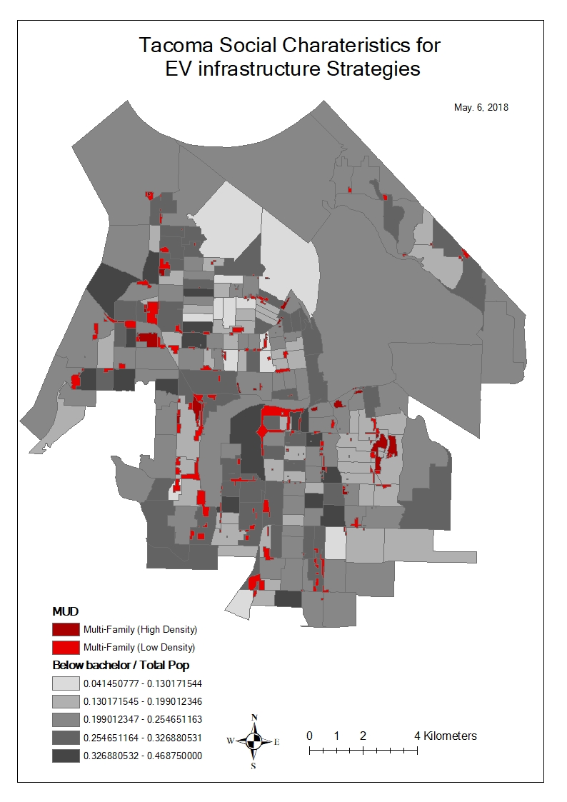
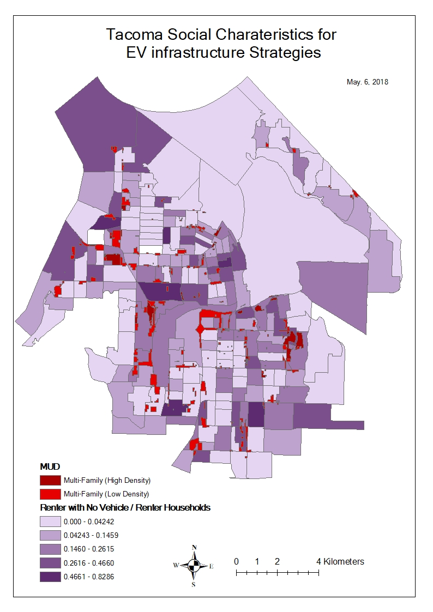
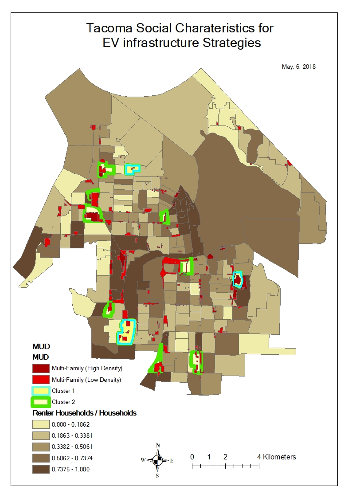

---
output:
  pdf_document: default
  html_document: default
---
# EV charger investment in Tacoma
* Cost-Benefit Analysis - Investor view
* Commission vs. incentive approaches
* Policy Design
* Optimization framework
* Equity & Efficiency Targeted Policies


# GIS social characteristics of Tacoma

It is known that EV onwers are more educated with higher income. Ye (2017) confirms, "Among the 15,408 survey respondents who specified their income, 77% had an annual household income of over $100,000. Among the 18,848 respondents who specified their education level, 34% of them obtained a Bachelor’s degree and 49% of them obtained a Graduate degree. Similarly, 81% of the respondents live in a single-family house; 75% of them are male, and 64% of them are white. According to this survey, EV owners are more likely to be male with relatively high income, possess a higher level of education attainment, and live in single family homes."

It is necessary in this regard to figure out the social characteristics of Tacoma for EV charger consideration. Hear are several maps showing them.








# Blocks with multi-family housings crossing the main area

A few blocks were chosen based on multi-family housings occupying the main area of the blocks. These blocks will be investigated against the rest of blocks to see any differences in terms of social characteristics.


14 variables (portion)

* Population density
* Male
* Age 35 to 64
* Non family household
* Education (Over bachelor)
* Rent household
* Median income
* Household income over $100,000
* Housing built before 2000
* Commuter more than 45 min to work
* Rent households with no vehicle
* Rent % income


{ height=800px }


```r
dat<-read.csv("./data/raw/dat - Copy1.csv")
data= data.frame(matrix(NA,560,16))
data[,1]=dat[,2]
data[,2]=dat[,3]
data[,3]=dat[,6]
data[,4]=dat[,7]/dat[,5]
data[,5]=dat[,9]/dat[,5]
data[,6]=dat[,11]/dat[,5]
data[,7]=dat[,16]/dat[,14]
data[,8]=dat[,17]/dat[,14]
data[,9]=dat[,21]/dat[,18]
data[,10]=dat[,26]/dat[,14]
data[,11]=dat[,27]
data[,12]=dat[,32]/dat[,14]
data[,13]=dat[,36]/dat[,14]
data[,14]=dat[,38]
data[,15]=dat[,44]/dat[,42]
data[,16]=dat[,50]/dat[,49]
data[is.na(data)]=0
colnames(data)=c("Geoid","select","pop.density","male","age35_64","white","nonfamily","renter","master","over100,000","med.income","over20units","buitbf2000","rantpctincome","45min.commute","no.vechicle.renter")
# str(data)
```


```r
pairs(data[-c(1,2)])
```


```r
library(corrplot)
```

```
## corrplot 0.84 loaded
```

```r
library(MASS)
```


```r
corrplot.mixed(cor(data[-c(1,2)]),upper="ellipse")
```


```r
M1 <- glm(as.factor(select)~ . -Geoid,data, family=binomial())
# stepAIC(M1)
M2 <- glm(formula = as.factor(select) ~ pop.density + nonfamily + renter + no.vechicle.renter, family = binomial(), data = data)
s=summary(M2)

library(kableExtra)
kable(coef(s), caption = "Binomial logistic model [note]", booktabs = T) %>%
  kable_styling(latex_options = c("hold_position")) %>%
  kable_styling(latex_options = c("striped", "scale_down"))%>%
  add_footnote(c("AIC is 95.92"), notation = "symbol")
```

\rowcolors{2}{gray!6}{white}
\begin{table}[!h]

\caption{\label{tab:unnamed-chunk-2}Binomial logistic model \textsuperscript{*}}
\centering
\resizebox{\linewidth}{!}{
\begin{tabular}[t]{lrrrr}
\hiderowcolors
\toprule
  & Estimate & Std. Error & z value & Pr(>|z|)\\
\midrule
\showrowcolors
(Intercept) & -5.8072650 & 0.9263109 & -6.269240 & 0.0000000\\
pop.density & 0.0001583 & 0.0000768 & 2.061436 & 0.0392615\\
nonfamily & -3.6263804 & 2.0501884 & -1.768803 & 0.0769267\\
renter & 3.3332370 & 1.2661521 & 2.632572 & 0.0084741\\
no.vechicle.renter & 4.3534712 & 1.8372864 & 2.369512 & 0.0178116\\
\bottomrule
\multicolumn{5}{l}{\textsuperscript{*} AIC is 95.92}\\
\end{tabular}}
\end{table}
\rowcolors{2}{white}{white}

It is estimated that more population density, more portion of rent housing with higher portion of no vehicle households, and less portion of non family households or more portion of family households are more likely correlated with blocks with more multi-family households.

Other regression model was built excluding the 3 erratic bock groups as below.


```r
data1 = data[-c(6,120,545),]
M1 <- glm(as.factor(select)~ . -Geoid,data1, family=binomial())
# stepAIC(M1)
M2 <- glm(formula = as.factor(select) ~ pop.density + renter, family = binomial(), data = data1)
s=summary(M2)

library(kableExtra)
kable(coef(s), caption = "Binomial logistic model [note]", booktabs = T) %>%
  kable_styling(latex_options = c("hold_position")) %>%
  kable_styling(latex_options = c("striped", "scale_down"))%>%
  add_footnote(c("AIC is 72.75"), notation = "symbol")
```

\rowcolors{2}{gray!6}{white}
\begin{table}[!h]

\caption{\label{tab:unnamed-chunk-3}Binomial logistic model \textsuperscript{*}}
\centering
\resizebox{\linewidth}{!}{
\begin{tabular}[t]{lrrrr}
\hiderowcolors
\toprule
  & Estimate & Std. Error & z value & Pr(>|z|)\\
\midrule
\showrowcolors
(Intercept) & -7.0291502 & 1.0766785 & -6.528551 & 0.0000000\\
pop.density & 0.0001444 & 0.0000783 & 1.844661 & 0.0650868\\
renter & 3.7222820 & 1.5444505 & 2.410101 & 0.0159481\\
\bottomrule
\multicolumn{5}{l}{\textsuperscript{*} AIC is 72.75}\\
\end{tabular}}
\end{table}
\rowcolors{2}{white}{white}

Population density and portion of rent households are the main factor for MUD characteristics in Tacoma.


# Factor and cluster analysis

To verify the characteristics of those blocks chosen above, factor and cluster analysis was performed. Two factors were chosen and the first factor (PA1) is related to the variables: "non-family households", "buiding units over 20", "rent households","population density","rent households with no vehicle","housings built before 2000 year" and the rest of variables are in the 2nd factor (PA2).


```r
library(psych)
library (cluster)
library(reshape)
library(ggplot2)
library(som)
library(GPArotation)

da = data[,-c(1,2)]
da = data.matrix(da)

fa.parallel(da,fa="both",n.iter=100)
```

<!-- -->

```
## Parallel analysis suggests that the number of factors =  5  and the number of components =  3
```

```r
fa <- fa(da,nfactors=2,rotate="promax",fm="pa")
dat1 <- fa$scores
factor.plot(fa, labels=rownames(fa$loadings))
```

<!-- -->

```r
fa.diagram(fa,simple=F)
```

<!-- -->

```r
# dim(da)

kmeans<-kmeans(dat1,center=2)
# kmeans
# summary(kmeans) # slots in kmeans object

set.seed(5099)
sum(kmeans(dat1,center=1)$withinss)
```

```
## [1] 969.1251
```

```r
wss <- (nrow(dat1)-1)*sum(apply(dat1,2,var))
for (i in 2:9) wss[i] <- sum(kmeans(dat1,centers=i)$withinss)
plot(1:9, wss, type="b", xlab="Number of Clusters",ylab="Within groups sum of squares")
```

<!-- -->

```r
kmeans$centers # centroids of clusters
```

```
##          PA1        PA2
## 1 -0.5523910  0.5931719
## 2  0.7528367 -0.8084157
```

```r
#number of samples in each cluster
table(kmeans$cluster)
```

```
## 
##   1   2 
## 323 237
```

```r
kmeans$centers
```

```
##          PA1        PA2
## 1 -0.5523910  0.5931719
## 2  0.7528367 -0.8084157
```

```r
Group1<-kmeans$centers[1,]
Group2<-kmeans$centers[2,]
plot(Group1,Group2,type="n")
text(Group1,Group2, labels=colnames(dat))
```

<!-- -->

```r
pairs(dat1, col=kmeans$cluster)
```

<!-- -->

```r
clusplot(dat1, kmeans$cluster, color=TRUE,shade=TRUE, labels=5, lines=0)
```

<!-- -->

```r
# library(rgl)
# plot3d(fa$scores, col = kmeans$cluster)
```

It is found the clusters are decided by the first factor (PA1). The first clustered group is more related to the higher value of PA1. Among the 11 chosen block groups with MUD, 3 block groups are clustered into the cluster 2nd group. We tried to go further analysis the difference between the 1st and the 2nd clustered group of the block groups chosen.


```r
GEOID_MUD = data[c(6,40,42,51,73,88,120,146,301,391,545),1]
GEOID_hetero = data[c(6,120,545), 1]

mud = data.frame(da[c(40,42,51,73,88,146,301,391),])
hetero = data.frame(da[c(6,120,545),])

par(mfrow=c(3,3))
for(i in 1:14) boxplot(mud[[i]], hetero[[i]], ylab= colnames(mud)[i], xlab="cluster 1, cluster 2")
```

<!-- --><!-- -->


```r
summary(mud)
```

```
##   pop.density         male           age35_64          white       
##  Min.   : 3062   Min.   :0.3523   Min.   :0.1720   Min.   :0.4223  
##  1st Qu.: 5392   1st Qu.:0.4493   1st Qu.:0.2778   1st Qu.:0.4732  
##  Median : 8119   Median :0.4702   Median :0.3848   Median :0.5698  
##  Mean   : 8136   Mean   :0.4688   Mean   :0.3434   Mean   :0.5955  
##  3rd Qu.:10599   3rd Qu.:0.4974   3rd Qu.:0.4027   3rd Qu.:0.6908  
##  Max.   :12787   Max.   :0.5460   Max.   :0.4571   Max.   :0.8604  
##    nonfamily          renter           master          over100.000     
##  Min.   :0.2833   Min.   :0.4674   Min.   :0.003106   Min.   :0.02683  
##  1st Qu.:0.3104   1st Qu.:0.5332   1st Qu.:0.018097   1st Qu.:0.03581  
##  Median :0.4699   Median :0.6913   Median :0.031601   Median :0.10082  
##  Mean   :0.4288   Mean   :0.7194   Mean   :0.046371   Mean   :0.11098  
##  3rd Qu.:0.5166   3rd Qu.:0.9231   3rd Qu.:0.067806   3rd Qu.:0.17282  
##  Max.   :0.5400   Max.   :0.9787   Max.   :0.115686   Max.   :0.23667  
##    med.income     over20units       buitbf2000     rantpctincome  
##  Min.   :22727   Min.   :0.0000   Min.   :0.8405   Min.   :28.60  
##  1st Qu.:29696   1st Qu.:0.1211   1st Qu.:0.8879   1st Qu.:29.70  
##  Median :36070   Median :0.1542   Median :0.9551   Median :33.35  
##  Mean   :38050   Mean   :0.1639   Mean   :0.9331   Mean   :35.02  
##  3rd Qu.:45439   3rd Qu.:0.2114   3rd Qu.:0.9748   3rd Qu.:40.60  
##  Max.   :57031   Max.   :0.3256   Max.   :1.0000   Max.   :44.50  
##  X45min.commute    no.vechicle.renter
##  Min.   :0.06738   Min.   :0.05205   
##  1st Qu.:0.09991   1st Qu.:0.16511   
##  Median :0.10368   Median :0.20556   
##  Mean   :0.14269   Mean   :0.21595   
##  3rd Qu.:0.14302   3rd Qu.:0.25659   
##  Max.   :0.31761   Max.   :0.39344
```

```r
summary(hetero)
```

```
##   pop.density         male           age35_64          white       
##  Min.   : 3221   Min.   :0.4653   Min.   :0.2788   Min.   :0.1667  
##  1st Qu.: 4304   1st Qu.:0.4805   1st Qu.:0.3467   1st Qu.:0.3637  
##  Median : 5387   Median :0.4957   Median :0.4145   Median :0.5606  
##  Mean   : 6328   Mean   :0.5067   Mean   :0.3814   Mean   :0.5516  
##  3rd Qu.: 7881   3rd Qu.:0.5275   3rd Qu.:0.4328   3rd Qu.:0.7440  
##  Max.   :10374   Max.   :0.5592   Max.   :0.4510   Max.   :0.9274  
##    nonfamily          renter            master         over100.000    
##  Min.   :0.2004   Min.   :0.09643   Min.   :0.01205   Min.   :0.1206  
##  1st Qu.:0.2124   1st Qu.:0.37626   1st Qu.:0.03004   1st Qu.:0.1554  
##  Median :0.2244   Median :0.65610   Median :0.04803   Median :0.1902  
##  Mean   :0.2499   Mean   :0.49663   Mean   :0.11796   Mean   :0.2762  
##  3rd Qu.:0.2747   3rd Qu.:0.69673   3rd Qu.:0.17092   3rd Qu.:0.3541  
##  Max.   :0.3250   Max.   :0.73735   Max.   :0.29380   Max.   :0.5179  
##    med.income      over20units        buitbf2000     rantpctincome  
##  Min.   : 21250   Min.   :0.00000   Min.   :0.1070   Min.   :31.30  
##  1st Qu.: 39518   1st Qu.:0.03502   1st Qu.:0.4242   1st Qu.:33.40  
##  Median : 57786   Median :0.07004   Median :0.7415   Median :35.50  
##  Mean   : 59956   Mean   :0.07782   Mean   :0.6162   Mean   :35.07  
##  3rd Qu.: 79310   3rd Qu.:0.11673   3rd Qu.:0.8707   3rd Qu.:36.95  
##  Max.   :100833   Max.   :0.16341   Max.   :1.0000   Max.   :38.40  
##  X45min.commute    no.vechicle.renter
##  Min.   :0.06771   Min.   :0.03346   
##  1st Qu.:0.10956   1st Qu.:0.16488   
##  Median :0.15142   Median :0.29630   
##  Mean   :0.14371   Mean   :0.21458   
##  3rd Qu.:0.18171   3rd Qu.:0.30514   
##  Max.   :0.21199   Max.   :0.31398
```

It is also found the 2nd clustered group which has the lower value of PA1 has the noticeable characteristics with lower population density, lower non-family households, higher median income, lower unit in a building, etc.

This analysis is essential to make a decision to have EV chargers considering these different social characteristics with MUD especially addressing equity.





# Cost-benefit analysis of charger

It is necessary to analyze how much would it benefit from installation of one charger. The benefit could be estimated by the fuel cost reduction as EV uses electricity. Assumping electricity price and gas price keep changing annually and annual discount factor is 6%, the cost - benefit analyses were constructed based on 4 cases. 1) onwer takes the installation cost of 1 charger and uses it, 2) owner takes the installation cost for the whole chargers (5 renters) and uses one of them, 3) owner doesn't live in the building, but pays the cost of all chargers (6 chargers) and get commission of 20% of the benefit generated from the chargers, and 4) with the case 3, there are additional 6 more EVs are using by sharing the 6 installed chargers. Net present value (NPV) and discounted payback period (DPP) are measured for each scenario. 

## Benefits

### Conventional vehicle
* VMT 10,230 miles
* MPG 33 miles/ gallon
* Gas required 310 gallons
* Gas unit price $2.49/ gallon
* Total cost $772

### EV
* Fuel economy 30 kWh/100 mile
* Elec. need per year 3069 kWh
* Elec. unit cost $0.077/ kWh
* Elec. cost $236.3

**Annual benefit for one car $535.7**
 
### Cost 
* Installation $2,050 (based on Megan's table)

After 100 times Monte Carlo simulations, it shows that case 1 takes less than 6 years to reach the break-even point, while case 2, over 20 years and case 3, about 18 years. This analysis indicates that government supports are necessary to benefit buiding owners for the same impact as the single family households. 

Moreover, MUD charger has potential as one charger could serve muliple EVs. The case 4 shows that it only takes about 10 years to reach the break-even point. Government support could be lessen compared to the case 3. 


```r
vmt=10230
mpg=33
gas=vmt/mpg
gas_c=2.49
c_cost=gas_c*gas

kw=3069
u_cost=0.077
e_cost=kw*u_cost

ben=c_cost-e_cost

inst=2050

rt=0.06
```


## case1, single owner - single user


```r
npv = c()
dpp = c()

for(j in 1:100){
  rgs=gas_c
  rei=u_cost
  cf=-inst
  q=data.frame(matrix(NA,25,6))
  for(i in 1:25){
    rgs = rgs*(1+runif(1,0.07,0.1)) #annual gas price increase
    rei = rei*(1+runif(1,0.07,0.1)) #annual elec. price increase
    fv=rgs*gas - kw*rei
    pv= fv/(1+rt)^i
    old=cf
    cf=cf+pv
    dp=ifelse(cf>0,i-1+abs(old/pv),0)
    q[i,]=c(rgs,rei,fv,pv,cf,dp)
  }
  npv[j]=sum(q[,4])-inst #net present value
  dpp[j]=min(q[,6][q[,6]>0]) #discounted payback period
}
plot(npv)
```

<!-- -->

```r
plot(dpp)
```

<!-- -->

```r
colnames(q) = c("Gas price($/gallon)","Elec.price($/kWh)","FV($)","PV($)","NPV($)","DPP(year)")
q
```

```
##    Gas price($/gallon) Elec.price($/kWh)     FV($)    PV($)     NPV($)
## 1             2.669826        0.08374505  570.6324 538.3324 -1511.6676
## 2             2.911727        0.09070153  624.2724 555.6002  -956.0674
## 3             3.129356        0.09952650  664.6535 558.0559  -398.0114
## 4             3.440411        0.10882314  732.5491 580.2475   182.2361
## 5             3.732874        0.11937087  790.8418 590.9630   773.1991
## 6             4.093360        0.12999968  869.9727 613.2964  1386.4955
## 7             4.435636        0.14055012  943.6988 627.6136  2014.1091
## 8             4.824144        0.15237986 1027.8310 644.8739  2658.9830
## 9             5.255228        0.16510522 1122.4128 664.3544  3323.3374
## 10            5.692146        0.17792377 1218.5171 680.4136  4003.7510
## 11            6.092734        0.19383626 1293.8640 681.5914  4685.3424
## 12            6.687965        0.20933985 1430.8053 711.0664  5396.4088
## 13            7.356733        0.22901933 1577.7270 739.7000  6136.1088
## 14            8.027663        0.24769375 1728.4035 764.4745  6900.5833
## 15            8.681201        0.27079512 1860.1020 776.1556  7676.7389
## 16            9.383375        0.29587739 2000.7986 787.6069  8464.3458
## 17           10.116543        0.32011693 2153.6896 799.8037  9264.1495
## 18           10.994381        0.34393914 2352.7089 824.2569 10088.4064
## 19           11.779514        0.37690350 2494.9325 824.6076 10913.0141
## 20           12.814268        0.40754384 2721.6710 848.6299 11761.6439
## 21           13.936480        0.44569660 2952.4660 868.4838 12630.1278
## 22           14.947734        0.47933109 3162.7303 877.6738 13507.8016
## 23           16.318797        0.51528259 3477.4247 910.3803 14418.1818
## 24           17.873076        0.55693967 3831.4056 946.2750 15364.4568
## 25           19.182801        0.60279455 4096.6919 954.5236 16318.9804
##    DPP(year)
## 1   0.000000
## 2   0.000000
## 3   0.000000
## 4   3.685934
## 5   4.308371
## 6   6.260727
## 7   8.209155
## 8  10.123261
## 9  12.002356
## 10 13.884290
## 11 15.874122
## 12 17.589177
## 13 19.295402
## 14 21.026571
## 15 22.890722
## 16 24.746916
## 17 26.583029
## 18 28.239395
## 19 30.234190
## 20 31.859569
## 21 33.542732
## 22 35.390458
## 23 36.837538
## 24 38.236778
## 25 40.096466
```

```r
mean(npv)
```

```
## [1] 16375.2
```

```r
mean(dpp)
```

```
## [1] 3.63117
```

```r
par(mfrow= c(1,1))
plot(q[,3], main = "Cash flow", ylab="$", xlab="year",
     type = 'l', ylim = c(min(q[,5]),max(q[,5])), col = 'red',lwd=3,cex.main=0.9)
lines(q[,4], type = 'l', col='blue',lwd=3)
lines(q[,5], type = 'l', col='orange',lwd=3)
legend("bottomright", legend=c("Annual FV","Annual PV","NPV"),col=c("red","blue","orange"), lty=1, box.lty = 0, lwd=7,cex=0.9)
```

<!-- -->

```r
par(mfrow= c(1,2))
plot(q[,1], main = "Gas price", ylab="$/gallon", xlab="year",
     type = 'l', ylim = c(min(q[,1]),max(q[,1])), col = 'red',lwd=3,cex.main=0.9)

plot(q[,2], main = "Electricity price", ylab="$/kWh", xlab="year",
     type = 'l', ylim = c(min(q[,2]),max(q[,2])), col = 'red',lwd=3,cex.main=0.9)
```

<!-- -->


## case2, one owner - 5 renters 


```r
npv = c()
dpp = c()

for(j in 1:100){
  rgs=gas_c
  rei=u_cost
  cf=-inst * 6 
  q=data.frame(matrix(NA,30,6))
  for(i in 1:30){
    rgs = rgs*(1+runif(1,0.07,0.1)) #annual gas price increase
    rei = rei*(1+runif(1,0.07,0.1)) #annual elec. price increase
    fv=rgs*gas - kw*rei
    pv= fv/(1+rt)^i
    old=cf
    cf=cf+pv
    dp=ifelse(cf>0,i-1+abs(old/pv),0)
    q[i,]=c(rgs,rei,fv,pv,cf,dp)
  }
  npv[j]=sum(q[,4])-inst #net present value
  dpp[j]=min(q[,6][q[,6]>0]) #discounted payback period
}
plot(npv)
```

<!-- -->

```r
plot(dpp)
```

<!-- -->

```r
colnames(q) = c("Gas price($/gallon)","Elec.price($/kWh)","FV($)","PV($)","NPV($)","DPP(year)")
q
```

```
##    Gas price($/gallon) Elec.price($/kWh)     FV($)     PV($)       NPV($)
## 1             2.671492        0.08357483  571.6714  539.3127 -11760.68732
## 2             2.912024        0.09114258  623.0109  554.4775 -11206.20985
## 3             3.150588        0.09983656  670.2839  562.7832 -10643.42660
## 4             3.461831        0.10902389  738.5734  585.0193 -10058.40727
## 5             3.783575        0.11980259  805.2341  601.7178  -9456.68950
## 6             4.157323        0.13097078  886.8208  625.1737  -8831.51580
## 7             4.521663        0.14289902  963.1583  640.5553  -8190.96050
## 8             4.939376        0.15303753 1061.5343  666.0198  -7524.94072
## 9             5.345041        0.16629902 1146.5909  678.6654  -6846.27533
## 10            5.828501        0.17832643 1259.5516  703.3270  -6142.94828
## 11            6.243269        0.19114562 1348.7875  710.5244  -5432.42383
## 12            6.719870        0.20748109 1446.4002  718.8166  -4713.60723
## 13            7.300413        0.22583652 1570.0358  736.0941  -3977.51316
## 14            7.923158        0.24414735 1706.8908  754.9594  -3222.55372
## 15            8.482182        0.26683368 1810.5637  755.4850  -2467.06875
## 16            9.273532        0.29332073 1974.5936  777.2914  -1689.77733
## 17           10.036061        0.31823546 2134.5142  792.6826   -897.09470
## 18           10.802181        0.34101300 2302.1071  806.5289    -90.56579
## 19           11.765578        0.37409569 2499.2296  826.0279    735.46210
## 20           12.857145        0.40616455 2739.1960  854.0942   1589.55635
## 21           13.902000        0.43806985 2965.1837  872.2248   2461.78117
## 22           15.146710        0.47186276 3247.3333  901.1516   3362.93273
## 23           16.610853        0.51334745 3573.9011  935.6375   4298.57024
## 24           18.153034        0.56284904 3900.0567  963.2303   5261.80058
## 25           19.563502        0.61055396 4190.8954  976.4729   6238.27347
## 26           21.156426        0.66144041 4528.5315  995.4166   7233.69011
## 27           23.232819        0.72129164 4988.5300 1034.4612   8268.15136
## 28           24.941160        0.78388983 5326.0017 1041.9265   9310.07783
## 29           26.891294        0.84465345 5744.0598 1060.1049  10370.18278
## 30           29.441136        0.90399608 6352.3882 1106.0151  11476.19792
##    DPP(year)
## 1    0.00000
## 2    0.00000
## 3    0.00000
## 4    0.00000
## 5    0.00000
## 6    0.00000
## 7    0.00000
## 8    0.00000
## 9    0.00000
## 10   0.00000
## 11   0.00000
## 12   0.00000
## 13   0.00000
## 14   0.00000
## 15   0.00000
## 16   0.00000
## 17   0.00000
## 18   0.00000
## 19  18.10964
## 20  19.86110
## 21  21.82242
## 22  23.73182
## 23  25.59427
## 24  27.46266
## 25  29.38858
## 26  31.26700
## 27  32.99271
## 28  34.93545
## 29  36.78222
## 30  38.37617
```

```r
mean(npv)
```

```
## [1] 21317.72
```

```r
mean(dpp)
```

```
## [1] 18.32301
```

```r
par(mfrow= c(1,1))
plot(q[,3], main = "Cash flow", ylab="$", xlab="year",
     type = 'l', ylim = c(min(q[,5]),max(q[,5])), col = 'red',lwd=3,cex.main=0.9)
lines(q[,4], type = 'l', col='blue',lwd=3)
lines(q[,5], type = 'l', col='orange',lwd=3)
legend("bottomright", legend=c("Annual FV","Annual PV","NPV"),col=c("red","blue","orange"), lty=1, box.lty = 0, lwd=7,cex=0.9)
```

<!-- -->

```r
par(mfrow= c(1,2))
plot(q[,1], main = "Gas price", ylab="$/gallon", xlab="year",
     type = 'l', ylim = c(min(q[,1]),max(q[,1])), col = 'red',lwd=3,cex.main=0.9)

plot(q[,2], main = "Electricity price", ylab="$/kWh", xlab="year",
     type = 'l', ylim = c(min(q[,2]),max(q[,2])), col = 'red',lwd=3,cex.main=0.9)
```

<!-- -->


## case3, no onwer but only 6 renters living 

Here it is assumed that the owner doesn't live in the building while collecting a commission of 20% of profit generated from the charger installation. This commission could be interpreted as the increased rental or tax credits if government supports. 


```r
npv = c()
dpp = c()
com = 0.2

for(j in 1:100){
  rgs=gas_c
  rei=u_cost
  cf=-inst * 6
  q=data.frame(matrix(NA,30,6))
  for(i in 1:30){
    rgs = rgs*(1+runif(1,0.07,0.1)) #annual gas price increase
    rei = rei*(1+runif(1,0.07,0.1)) #annual elec. price increase
    fv=com*6*(rgs*gas - kw*rei)
    pv= fv/(1+rt)^i
    old=cf
    cf=cf+pv
    dp=ifelse(cf>0,i-1+abs(old/pv),0)
    q[i,]=c(rgs,rei,fv,pv,cf,dp)
  }
  npv[j]=sum(q[,4])-inst #net present value
  dpp[j]=min(q[,6][q[,6]>0]) #discounted payback period
}
plot(npv)
```

<!-- -->

```r
plot(dpp)
```

<!-- -->

```r
colnames(q) = c("Gas price($/gallon)","Elec.price($/kWh)","FV($)","PV($)","NPV($)","DPP(year)")
q
```

```
##    Gas price($/gallon) Elec.price($/kWh)     FV($)     PV($)      NPV($)
## 1             2.701327        0.08435266  694.2396  654.9430 -11645.0570
## 2             2.922005        0.09159535  749.6586  667.1935 -10977.8635
## 3             3.209460        0.10001647  825.5786  693.1717 -10284.6919
## 4             3.450529        0.10804450  885.6905  701.5498  -9583.1420
## 5             3.713179        0.11752872  948.4680  708.7505  -8874.3916
## 6             3.998281        0.12655497 1021.2839  719.9649  -8154.4267
## 7             4.344456        0.13543177 1117.3697  743.1147  -7411.3120
## 8             4.739218        0.14868702 1215.4045  762.5598  -6648.7522
## 9             5.124656        0.16130404 1312.3217  776.7612  -5871.9910
## 10            5.513357        0.17361431 1411.5821  788.2201  -5083.7709
## 11            5.981950        0.18841788 1531.3800  806.7119  -4277.0591
## 12            6.445496        0.20213412 1653.3052  821.6420  -3455.4171
## 13            6.982688        0.21742880 1796.8131  842.4161  -2613.0009
## 14            7.664846        0.23306517 1992.9902  881.5015  -1731.4995
## 15            8.385914        0.25594873 2176.9522  908.3661   -823.1334
## 16            9.077929        0.27887638 2349.9437  925.0466    101.9133
## 17            9.963860        0.29866669 2606.6264  968.0083   1069.9215
## 18           10.764008        0.32627570 2802.6027  981.8744   2051.7960
## 19           11.711700        0.35596408 3045.8080 1006.6792   3058.4751
## 20           12.740631        0.38635687 3316.6397 1034.1439   4092.6191
## 21           13.784176        0.42172911 3574.5695 1051.4789   5144.0980
## 22           14.903818        0.46219313 3842.0554 1066.1899   6210.2880
## 23           16.260234        0.50493968 4189.2151 1096.7250   7307.0130
## 24           17.756814        0.54121399 4612.3520 1139.1520   8446.1650
## 25           19.040824        0.59387337 4896.0697 1140.7775   9586.9425
## 26           20.395633        0.64934255 5195.7767 1142.0838  10729.0264
## 27           21.995425        0.69520621 5621.9925 1165.8211  11894.8474
## 28           24.141993        0.74821821 6225.2833 1217.8531  13112.7005
## 29           26.296622        0.80269293 6826.1857 1259.8186  14372.5191
## 30           28.496746        0.87885708 7364.1345 1282.1704  15654.6895
##    DPP(year)
## 1    0.00000
## 2    0.00000
## 3    0.00000
## 4    0.00000
## 5    0.00000
## 6    0.00000
## 7    0.00000
## 8    0.00000
## 9    0.00000
## 10   0.00000
## 11   0.00000
## 12   0.00000
## 13   0.00000
## 14   0.00000
## 15   0.00000
## 16  15.88983
## 17  16.10528
## 18  18.08967
## 19  20.03818
## 20  21.95749
## 21  23.89225
## 22  25.82475
## 23  27.66258
## 24  29.41443
## 25  31.40387
## 26  33.39425
## 27  35.20298
## 28  36.76706
## 29  38.40840
## 30  40.20952
```

```r
mean(npv)
```

```
## [1] 26232.03
```

```r
mean(dpp)
```

```
## [1] 15.6409
```

```r
par(mfrow= c(1,1))
plot(q[,3], main = "Cash flow", ylab="$", xlab="year",
     type = 'l', ylim = c(min(q[,5]),max(q[,5])), col = 'red',lwd=3,cex.main=0.9)
lines(q[,4], type = 'l', col='blue',lwd=3)
lines(q[,5], type = 'l', col='orange',lwd=3)
legend("bottomright", legend=c("Annual FV","Annual PV","NPV"),col=c("red","blue","orange"), lty=1, box.lty = 0, lwd=7,cex=0.9)
```

<!-- -->

```r
par(mfrow= c(1,2))
plot(q[,1], main = "Gas price", ylab="$/gallon", xlab="year",
     type = 'l', ylim = c(min(q[,1]),max(q[,1])), col = 'red',lwd=3,cex.main=0.9)

plot(q[,2], main = "Electricity price", ylab="$/kWh", xlab="year",
     type = 'l', ylim = c(min(q[,2]),max(q[,2])), col = 'red',lwd=3,cex.main=0.9)
```

<!-- -->

## case4, 12 renters (sharing chargers) but rest conditions are the same as case3. 

This case, 2 EV owners are using one charger by sharing it given the same utilization rate as the case3. 


```r
npv = c()
dpp = c()
com = 0.2

for(j in 1:100){
  rgs=gas_c
  rei=u_cost
  cf=-inst * 6
  q=data.frame(matrix(NA,20,6))
  for(i in 1:20){
    rgs = rgs*(1+runif(1,0.07,0.1)) #annual gas price increase
    rei = rei*(1+runif(1,0.07,0.1)) #annual elec. price increase
    fv=com*12*(rgs*gas - kw*rei)
    pv= fv/(1+rt)^i
    old=cf
    cf=cf+pv
    dp=ifelse(cf>0,i-1+abs(old/pv),0)
    q[i,]=c(rgs,rei,fv,pv,cf,dp)
  }
  npv[j]=sum(q[,4])-inst #net present value
  dpp[j]=min(q[,6][q[,6]>0]) #discounted payback period
}
plot(npv)
```

<!-- -->

```r
plot(dpp)
```

<!-- -->

```r
colnames(q) = c("Gas price($/gallon)","Elec.price($/kWh)","FV($)","PV($)","NPV($)","DPP(year)")
q
```

```
##    Gas price($/gallon) Elec.price($/kWh)    FV($)    PV($)      NPV($)
## 1             2.736259        0.08277969 1426.055 1345.335 -10954.6652
## 2             2.968567        0.08944176 1549.822 1379.336  -9575.3291
## 3             3.235900        0.09763633 1688.359 1417.579  -8157.7502
## 4             3.551887        0.10615940 1860.677 1473.830  -6683.9201
## 5             3.855002        0.11656823 2009.527 1501.635  -5182.2848
## 6             4.139014        0.12537143 2155.990 1519.888  -3662.3966
## 7             4.431245        0.13616362 2293.920 1525.588  -2136.8091
## 8             4.748189        0.14917118 2433.917 1527.070   -609.7392
## 9             5.117312        0.16295257 2607.037 1543.101    933.3618
## 10            5.567974        0.17696414 2839.125 1585.353   2518.7146
## 11            6.102246        0.19245591 3122.517 1644.903   4163.6178
## 12            6.631992        0.20763138 3404.872 1692.117   5855.7350
## 13            7.287410        0.22542554 3761.439 1763.509   7619.2442
## 14            7.856218        0.24618046 4031.759 1783.251   9402.4951
## 15            8.613850        0.26843791 4431.498 1849.109  11251.6045
## 16            9.273255        0.28859033 4773.661 1879.134  13130.7383
## 17           10.159799        0.31273335 5255.421 1951.676  15082.4147
## 18           11.042436        0.33590887 5741.402 2011.465  17093.8793
## 19           12.058351        0.36339217 6294.811 2080.517  19174.3964
## 20           12.912303        0.39873181 6669.854 2079.692  21254.0884
##    DPP(year)
## 1   0.000000
## 2   0.000000
## 3   0.000000
## 4   0.000000
## 5   0.000000
## 6   0.000000
## 7   0.000000
## 8   0.000000
## 9   8.395139
## 10  9.588741
## 11 11.531224
## 12 13.460597
## 13 15.320502
## 14 17.272671
## 15 19.084878
## 16 20.987655
## 17 22.727928
## 18 24.498225
## 19 26.216169
## 20 28.219825
```

```r
mean(npv)
```

```
## [1] 31108.62
```

```r
mean(dpp)
```

```
## [1] 8.542252
```

```r
par(mfrow= c(1,1))
plot(q[,3], main = "Cash flow", ylab="$", xlab="year",
     type = 'l', ylim = c(min(q[,5]),max(q[,5])), col = 'red',lwd=3,cex.main=0.9)
lines(q[,4], type = 'l', col='blue',lwd=3)
lines(q[,5], type = 'l', col='orange',lwd=3)
legend("bottomright", legend=c("Annual FV","Annual PV","NPV"),col=c("red","blue","orange"), lty=1, box.lty = 0, lwd=7,cex=0.9)
```

<!-- -->

```r
par(mfrow= c(1,2))
plot(q[,1], main = "Gas price", ylab="$/gallon", xlab="year",
     type = 'l', ylim = c(min(q[,1]),max(q[,1])), col = 'red',lwd=3,cex.main=0.9)

plot(q[,2], main = "Electricity price", ylab="$/kWh", xlab="year",
     type = 'l', ylim = c(min(q[,2]),max(q[,2])), col = 'red',lwd=3,cex.main=0.9)
```

<!-- -->


```r
library(nloptr)
c = 2050 #cost for one charger
m = 100*c #capacity
n = 11 #number of places for demand
npv = c(11741.5,1601) # (-5000,1500) #single,
c1 = c(0.3,0.7)
c2 = c(0.1,0.9)
cc1= t(c1)%*%npv
cc2= t(c2)%*%npv
b = c(rep(cc1,3),rep(cc2,8)) #benefit per cluster
pop=c(0.049,0.095,0.112,0.099,0.067,0.128,0.062,0.076,0.053,0.154,0.105) #population weight
bp=pop*b #total benefit

names(pop) = c("cA_1","cA_2","cA_3","cB_1","cB_2","cB_3","cB_4","cB_5","cB_6","cB_7","cB_8")
barplot(pop, col = "orange", main = "Population proportion in MUD blocks", 
        xlab="MUDs", ylab="Relative portion of population",cex.names = 0.7)
```

<!-- -->

```r
# Objective function EQUITY
alpha = 1 # fair
eval.f <- function(x) {return(-sum(b*log(x)))} #max

# Constraint function
# to be of the form g(x) <= 0
eval.g <- function(x) {
  return(sum(c*x) - m)
}

x0 <- rep(9,11)

opts <- list('algorithm' = 'NLOPT_GN_ISRES', 'xtol_rel' = 1.0e-8, 'maxeval' = 100000)

eq = nloptr(
  x0 = x0,
  eval_f = eval.f,
  lb = rep(0,11),
  ub = rep(100,11),
  eval_g_eq = eval.g,
  opts = opts
)

par(mfrow=c(1,2))
bar1 = eq$solution
names(bar1) = c("cA_1","cA_2","cA_3","cB_1","cB_2","cB_3","cB_4","cB_5","cB_6","cB_7","cB_8")
barplot(bar1, col = "blue", main = "Equity oriented policy", 
        xlab="MUDs", ylim = c(0,80),ylab="number of chargers",cex.names = 0.7)


# Objective function Efficiency
alpha = 0 
eval.f <- function(x) {return (-sum(b*x^(1-alpha)/(1-alpha)))} #max


# Constraint function
# to be of the form g(x) <= 0
eval.g <- function(x) {
  return(sum(c*x) - m)
}

x0 <- rep(9,11)

opts <- list('algorithm' = 'NLOPT_GN_ISRES', 'xtol_rel' = 1.0e-8, 'maxeval' = 100000)

ef = nloptr(
  x0 = x0,
  eval_f = eval.f,
  lb = rep(0,11),
  ub = rep(100,11),
  eval_g_eq = eval.g,
  opts = opts
)

bar = ef$solution
names(bar) = c("cA_1","cA_2","cA_3","cB_1","cB_2","cB_3","cB_4","cB_5","cB_6","cB_7","cB_8")
barplot(bar, col = "red", main = "Efficiency oriented policy", 
        xlab="MUDs", ylim = c(0,80), ylab="number of chargers",cex.names = 0.7)
```

<!-- -->

