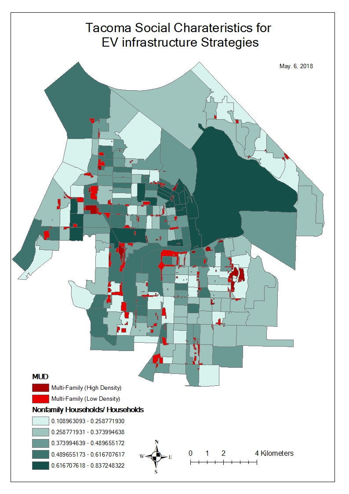

# Social characteristics of Tacoma 

It is known that electrci vehicle (EV) onwers are more educated with higher income. Ye (2017) confirms, "Among the 15,408 survey respondents who specified their income, 77% had an annual household income of over $100,000. Among the 18,848 respondents who specified their education level, 34% of them obtained a Bachelor’s degree and 49% of them obtained a Graduate degree. Similarly, 81% of the respondents live in a single-family house; 75% of them are male, and 64% of them are white. According to this survey, EV owners are more likely to be male with relatively high income, possess a higher level of education attainment, and live in single family homes." It is necessary in this regard to figure out the social characteristics of Tacoma for EV charger consideration. Here are several maps showing them.

In the scope of this study the social characteristics of different blocks in Tacoma were analyzed and blocks with MUDs are likely to have higher population density and a higher proportion of rental housing. Therefore, in order to achieve social equity in EVSE accessibility, the government should consider suitable charging solutions for MUDs in addition to public, workplace and single-family residence charging. Moreover, based on a performed cluster analysis, two clusters of MUD-intense blocks were found to have different social characteristics. Compared to Cluster 1, Cluster 2 has a higher population density, lower average income, lower education level, higher building age and a higher proportion of rental housing. The government needs to develop different strategies to address EVSE installations for the two clusters.

## Cenesus blocks with multi-family housings

A few blocks were chosen based on multi-family housings or multi-unit dwellings (MUD) occupying the main area of the blocks. These blocks will be investigated against the rest of blocks to see any differences in terms of social characteristics.


14 variables (in proportion)

* Population density
* Male
* Age 35 to 64
* Non family household
* Education (Over bachelor)
* Rent household
* Median income
* Household income over $100,000
* Housing built before 2000
* Commuter more than 45 min to work
* Rent households with no vehicle
* Rent % income





<table class="table table" style="margin-left: auto; margin-right: auto; margin-left: auto; margin-right: auto;">
<caption>Binomial logistic model <sup>*</sup></caption>
 <thead>
  <tr>
   <th style="text-align:left;">   </th>
   <th style="text-align:right;"> Estimate </th>
   <th style="text-align:right;"> Std. Error </th>
   <th style="text-align:right;"> z value </th>
   <th style="text-align:right;"> Pr(&gt;|z|) </th>
  </tr>
 </thead>
<tbody>
  <tr>
   <td style="text-align:left;"> (Intercept) </td>
   <td style="text-align:right;"> -5.8072650 </td>
   <td style="text-align:right;"> 0.9263109 </td>
   <td style="text-align:right;"> -6.269240 </td>
   <td style="text-align:right;"> 0.0000000 </td>
  </tr>
  <tr>
   <td style="text-align:left;"> pop.density </td>
   <td style="text-align:right;"> 0.0001583 </td>
   <td style="text-align:right;"> 0.0000768 </td>
   <td style="text-align:right;"> 2.061436 </td>
   <td style="text-align:right;"> 0.0392615 </td>
  </tr>
  <tr>
   <td style="text-align:left;"> nonfamily </td>
   <td style="text-align:right;"> -3.6263804 </td>
   <td style="text-align:right;"> 2.0501884 </td>
   <td style="text-align:right;"> -1.768803 </td>
   <td style="text-align:right;"> 0.0769267 </td>
  </tr>
  <tr>
   <td style="text-align:left;"> renter </td>
   <td style="text-align:right;"> 3.3332370 </td>
   <td style="text-align:right;"> 1.2661521 </td>
   <td style="text-align:right;"> 2.632572 </td>
   <td style="text-align:right;"> 0.0084741 </td>
  </tr>
  <tr>
   <td style="text-align:left;"> no.vechicle.renter </td>
   <td style="text-align:right;"> 4.3534712 </td>
   <td style="text-align:right;"> 1.8372864 </td>
   <td style="text-align:right;"> 2.369512 </td>
   <td style="text-align:right;"> 0.0178116 </td>
  </tr>
</tbody>
<tfoot>
<tr>
<td style = 'padding: 0; border:0;' colspan='100%'><sup>*</sup> AIC is 95.92</td>
</tr>
</tfoot>
</table>

It shows that higher population density, proportion of rent housing, proportion of non-vehicle households, and proportion of family households, are more likely to be correlated with blocks having more multi-family households.

Furthermore, another regression model was built excluding the 3 erratic block groups as below.

<table class="table table" style="margin-left: auto; margin-right: auto; margin-left: auto; margin-right: auto;">
<caption>Binomial logistic model <sup>*</sup></caption>
 <thead>
  <tr>
   <th style="text-align:left;">   </th>
   <th style="text-align:right;"> Estimate </th>
   <th style="text-align:right;"> Std. Error </th>
   <th style="text-align:right;"> z value </th>
   <th style="text-align:right;"> Pr(&gt;|z|) </th>
  </tr>
 </thead>
<tbody>
  <tr>
   <td style="text-align:left;"> (Intercept) </td>
   <td style="text-align:right;"> -7.0291502 </td>
   <td style="text-align:right;"> 1.0766785 </td>
   <td style="text-align:right;"> -6.528551 </td>
   <td style="text-align:right;"> 0.0000000 </td>
  </tr>
  <tr>
   <td style="text-align:left;"> pop.density </td>
   <td style="text-align:right;"> 0.0001444 </td>
   <td style="text-align:right;"> 0.0000783 </td>
   <td style="text-align:right;"> 1.844661 </td>
   <td style="text-align:right;"> 0.0650868 </td>
  </tr>
  <tr>
   <td style="text-align:left;"> renter </td>
   <td style="text-align:right;"> 3.7222820 </td>
   <td style="text-align:right;"> 1.5444505 </td>
   <td style="text-align:right;"> 2.410101 </td>
   <td style="text-align:right;"> 0.0159481 </td>
  </tr>
</tbody>
<tfoot>
<tr>
<td style = 'padding: 0; border:0;' colspan='100%'><sup>*</sup> AIC is 72.75</td>
</tr>
</tfoot>
</table>

It shows that population density and portion of rent households are the main factors for MUD characteristics in Tacoma.


## Factor and cluster analysis

To verify the characteristics of those blocks chosen above, factor and cluster analysis was performed. Two factors were chosen and the first factor (PA1) is related to the variables: "non-family households", "buiding units over 20", "rent households","population density","rent households with no vehicle","housings built before 2000 year" and the rest of variables are in the 2nd factor (PA2).


<!-- -->

It is found the clusters are mainly distinguished by the first factor (PA1). The first clustered group is more related to the higher value of PA1. Among the 11 chosen block groups with MUD, 3 block groups are clustered into the cluster 2nd group. We tried to perform the further analysis with the difference between the 1st and the 2nd clustered groups.

<!-- --><!-- -->


It is also found that the 2nd clustered group which has the lower value of PA1 has the noticeable characteristics with lower population density, lower non-family households, higher median income, lower units in a building, etc.

This analysis is essential to make a decision for EV chargers considering these different social characteristics for MUD especially addressing equity.


# Cost-benefit analysis

To assess how rebates can be applied in the proposed policies, it needed to be analyzed how the expected benefits through the installation of a charger compare to their cost and calculate a break-even point. This analysis assumes EV-ready buildings and will be based on the outcome of the previous sections and the fuel cost reduction achieved by using EVs, plus the installation cost of the chargers. This break-even point heavily depends on the individual situation (condos, apartments, owner-renter relationships, etc.). Assuming annual changes of gasoline and energy prices and an annual discount factor of 6%, four different example cases were provided:

* Case 1: Condo - Owner invests into the installation of one charger for personal use
* Case 2: Mixed Condo / Rental apartments (condo owner owns 5 additional units in the building and rents them out to tenants) - Owner invests into multiple chargers and uses one of them
* Case 3: Rental apartments - Landlord invests into a set of chargers (in this case we assume 6 chargers), while not using any of them for personal use and receiving a commission of 20% of the benefits generated through the chargers
* Case 4: Rental apartments - Sharing chargers with case 3 above - 12 renters are sharing 6 installed chargers (2 renters share 1 charger)

These cases all assume that the installed chargers will be used such that the upfront cost for a charger (level 2 stands alone) is \$2,050 for charger ready sites. The net present value (NPV) and discounted payback period (DPP) were measured for each scenario. We assume the annual vehicle miles travelled to be 10,230 miles per vehicle and an average MPG of 33 according to the standard applied to the year 2017. Thus, an internal combustion engine (ICE) vehicle requires 310 gallons of fuel on average per year. The total cost was calculated to be \$772 per year based in a fuel price of \$2.49 / gallon. For EVs we assume the same mileage and a fuel economy of 30 kWh / 100 miles (34 kWh/ 100 miles for Tesla models S - 90D, 30 kWh/ 100 miles for Nissan Leaf, 32 kWh/ 100 miles for Kia Soul). Thus, the annual energy requirement is 3069 kWh. Based on a price of \$0.077/kWh the annual cost is calculated as \$236.30, which results in an annual benefit in operational cost of \$535.70 per EV. For case 1, we achieve break-even within less than 6 years, which is reasonable as the investor directly receives their Return-On-Investment (ROI). In each case, Net present value (NPV), present value (PV) and future value (FV) would be measured. This is a case comparable to single family housing EVSE.


## Assumptions for benefit estimates 

### Conventional vehicle

* Vehicle mile traveled (VMT): 10,230 miles
* Mile per gallon (MPG): 33 miles/ gallon
* Gas required: 310 gallons
* Gas unit price: $2.49/ gallon
* Total gas cost: $772

### EV

* Fuel economy: 30 kWh/100 mile
* Electricity need per year: 3069 kWh
* Electricity unit cost: $0.077/ kWh
* Total electricity cost $236.3

**Annual benefit for one average car, $535.7** is estimated based on the assumptions above. 
 
### Cost 
* Installation of one unit charger to a residential house $2,050 


## Case1, single owner - single user

After 100 times of Monte Carlo simulations, it shows that case 1 takes less than 6 years to reach the break-even point, while case 2, over 20 years and case 3, about 18 years. This analysis indicates that government supports are necessary to benefit buiding owners for the same impact as the single family households. Moreover, EV charger on MUD has potential as one charger could serve muliple EVs. The case 4 shows that it only takes about 10 years to reach the break-even point. Government support could be lessen compared to the case 3. 

<!-- --><!-- -->


## Case2, one owner - 5 renters 

For the case 2, the break-even will not be reached before 20 years after the investment. 

<!-- --><!-- -->


## Case3, no onwer but only 6 renters living 

The Case 3 assumes that the landlord does not live in the building and receives a commission of 20% of the installation cost, in the form of increased property value and/or rent increases that are possible due to the higher attractiveness of the property. Also, in this case, the break-even will not be reached until around 18 years. 

<!-- --><!-- -->

## Case4, 12 renters (sharing chargers) but rest conditions are the same as case3. 

Since the case 3 assumes that every charger will be used by one tenant, assuming assigned parking lot charging, we furthermore provide an alternative approach (case 4) for 12 rental units that share 6 chargers. In the case 4, the break-even can be reached within 10 years, as Figure 10 shows. Cases 2 and 3 clearly indicate that the break-even point for rental apartments is difficult to reach. Thus, if the city of Tacoma aims for making EVSE attractive to rental complexes, the incentives will have to be much higher to motivate landlords to invest. Even after taking into account the possibility to share chargers, such as in the case 4, it is still insufficient to mobilize the landlords to install EVSE without additional incentives. As outlined previously, this assumes EV-ready buildings, the time until break-even will be reached is even longer for installing in non-EV ready buildings.

<!-- -->

```
## [1] 31247.43
```

```
## [1] 8.516698
```

<!-- --><!-- -->


In summary, as the simulations show, to get a benefit through the installation of chargers at MUDs that is comparable to the benefits at single family households, it is necessary to create a mechanism to collect commissions for the benefit coming from EV chargers like the case 3 where the landlord collects 20% of benefit generated from the renters using chargers. Moreover, rather than one assigned charger, sharing chargers with other renters like the case 4, would enhance the pay-off dynamics, thus would lead to an earlier expected break-even point. 

## Commission vs. Incentive 

As the previous cost benefit analysis shows, in order to make the investment of chargers as
effective as for single family households, there should be support to MUD owners who need to
invest their private funds for the installation of chargers. Taking into account the previous case
analysis, a DPP of 5 years should be targeted if we aim at achieving a similar benefit as for
the case 1. This section investigates how high the incentives would have to be to achieve this goal
for the case 2, case 3 and case 4.

For the case 2, the incentive would have to be at least 80% of the upfront cost. A figure below shows that an incentive of 50% would still not be enough.

<!-- -->


For the case 3, the results are very similar. Hence, both case 2 and case 3 would require an incentive to cover around 80% to receive a comparable DPP as single-family household or condo owners receive.

<!-- -->


However, we found out that if we increase the commission to 50%, we can relax the incentive from 80% to 40% to meet the DPP of 5 years. With the same commission of 50%, having no incentive still meets a DPP of 8 years. This shows that collecting a commission fee is more effective than incentivizing the upfront cost of installation of chargers. 

To achieve the DPP of 5 years like the case 1 (1 owner single family), commission rate and incentive rate were estimated for each scenario: the case 3, rental apartment (no owner living) and the case 4, rental apartment (sharing chargers in addition to the case 3 above - 12 renters are sharing 6 installed chargers).

## Incentive comparison (case 3)

For the case 3, rental apartment, with the commission rate, 50%, it is estimated that about 40% incentive is required to meet the 5 year's DPP. It also shows there is not much improvement for shortening the DPP even if there is no incentive (in this case, the DPP is 8 years). We can see incentive supports a little from the investment perspectives. 

<!-- -->

## Commission comparison (case 4)

Adding a 60% incentive of upfront cost to case 4, shows a DPP of 5 years, which can also be achieved through changing the commission fee to 50% . It also confirms that commissions are more effective to reach the goal of a shorter DPP than incentivizing the upfront cost. However, we need to take into account that increasing the commission fees will heavily decrease the benefit to the renter of the apartments, which can result in equity issues for lower income groups as this could make switching to an EV infeasible for these groups. 

Furthermore, it was found that sharing chargers by two, is as effective as collecting commissions. By increasing the number of users for a given charger we can enhance the mechanism for owners to reach shorter DPP. By optimizing the utilization rate of chargers depending upon the local conditions, it can reduce the commissioning rate while getting the same result and thus deliver added value to both the renter and the landlord. Policy makers can take this account to support investment of chargers.  

<!-- -->


# Policy optimization

Assuming that the monetary capacity to motivate the installation of chargers at MUDs is limited, it was seen as valuable to offer a set of options to further focus the direction of the incentives and optimize the outcome based on the objectives of the city of Tacoma. As already mentioned, the City of Tacoma aims at finding solutions that achieve their goals most effectively and equitably. Based on which of these two parameters is seen as more important, different policies could be designed. After having shown in the cost benefit and rebate analysis that similar results can be gained through different approaches, it was decided to offer options to go down either a route optimizing equity or one optimizing efficiency. Conditional on the available budget it could even be possible to combine them into one approach. This approach follows the idea of a fairness model that balances equity and efficiency for policy making, which was part of a research paper by McCoy. McCoy applied the model to health delivery fleet management, but it could be applied to this case as well. The basic model defines two objective functions (one to maximize efficiency and one to maximize equity) that are applied to a set of capacity constraints. Applied to this case, depending on the parameter $\alpha$ >= 0, either the efficiency or effectivity function would be applied with $\beta$ describing the relative utility of installing a charger at unit x. Through changing the value of $\alpha$, the balance between efficiency and equity can be controlled. The available budget is determined by the parameter m that restricts the cost over all units. C represents the cost of installation per case i. 


$$
f(x) = 
\begin{cases}
\sum_{i=1}^{n}\beta_i\frac{{X_i}^{1-\alpha}}{1-\alpha}, & \alpha \not= 1 \\
\sum_{i=1}^{n}\beta_i\ln(x_i), & \alpha = 1 
\end{cases}
$$

$$
\begin{aligned}
&\text{maximize} ~~f(x) \\
&\begin{aligned}
s.t. \sum_{i=1}^{n}c_ix_i &\le m \\
x_i &\ge 0,~i = 1,2,...,n.
\end{aligned}
\end{aligned}
$$


We start our policy effect analysis based on a case that assumes the installation of stand-alone level 2 chargers (\$2,050 installation cost) with a budget limited to 100 chargers (i.e. \$205,000), For the eleven MUD block groups that were defined in the cluster analysis for Tacoma we find three of them related to the higher income cluster (1) while cluster 2 is more related to the characteristics of the remaining 8 block groups. To keep this analysis within simple bounds, we only consider the ownership structure cases 1 and 2 from the cost benefit analysis. 

Based on the identified renter and owner distribution structure of the MUD block clusters 1 and 2, the cluster 1 (i.e. 3 block groups) are assumed to include 30% of MUDs with the case 1 structure and 70% of the case 2 structure; cluster 2 (8 block groups) is assumed to have 10% of the case 1 structure and 90% of the case 2 structure.

The aim of the following analysis is to check how different social or rent household structures in MUDs affect the outcome of the selected policy application in terms of efficiency and equity. We considered a cash flow time horizon of 20 years to receive an average expected NPV per unit charger. Furthermore, based on the population of each block group, each of them was weighted in proportion to its population assuming that the EVSE demand is proportional to the population. 

These benefit weights were added to the objective functions of the maximization problem. The policy parameter $\alpha$ was set to different values depending on the policy goals. The efficiency-oriented policy seeks to maximize the benefit by focusing more on efficiency. By concentrating on cA_1, cA_2 and cA_3, which happen to be all cluster 1, the maximized benefit in terms of saved energy turns out to be $446,695 for a 20-year time horizon. This is the maximum benefit from installing 100 chargers. Thus, focusing on these block groups would maximize the efficiency. 

On the other hand, the equity policy seeks to maximize the benefit while focusing more on equity. The optimal solution was found and the expected benefit in terms of saved energy is estimated to \$78,191 over a 20-year time horizon. This benefit is far lower than for the efficiency policy while it improves the equal resource allocation for all MUD block groups regardless of which cluster they are belong to. 


<!-- --><!-- -->


# Concolusion 

As stated previously, the goal of these actions is to encourage the use of Electric Vehicles in Tacoma. As you would expect, these chargers may not be fully utilized immediately after installation as EV ownership continues to grow. The demand should rise to meet the supply, and from what can be seen in the history of EV recently, it will. 

These were the large variance in social characteristics, the large variance in EV readiness in between different buildings and the large variance in cost to install chargers. Furthermore, the attractiveness for an installation is significantly different between condo and apartment complexes. This was confirmed through showing how the DPP differs in reaching the break-even of the investment for different ownership structures. Taking these findings into account, it was decided to offer the City of Tacoma a range of options to either optimize their policies for efficiency or for equity, as it was not entirely clear what should be pursued at a higher priority. Based on a fairness model, the effects of the policy optimization were illustrated, and corresponding policy proposals were developed including a final cost estimate for each policy. 

Seeing as there is a significant number of residents in Tacoma that live in MUDs, these policy proposals will increase the attractivity of owning and operating an EV for residents of MUDs and furthermore motivate them to make the switch to a more sustainable mode of mobility.  This will deliver significant added value to the emissions reduction targets of the City of Tacoma. Additionally, since MUD buildings are dense, an installation can get the attention of other residents and thus cause more people to consider moving towards EVs. Together with the results of the investigations on single family, public and workplace charging, this should deliver a valuable contribution to the achievement of Tacoma’s electric mobility targets for 2020.

A final recommendation that aims at receiving more accurate cost estimates, is to pursue a thorough inventory analysis, that investigates the real distributions of EV readiness, income distribution, ownership structure and expected desire to own electric vehicles within MUDs and their residents, since this analysis had to make many assumptions to estimate the expected benefits, costs and dynamics. This could be achieved through surveys, sampling or enhanced census data. Further analysis should assess, whether the trade-off in cost for this inventory analysis is worth the gain in data accuracy. 
