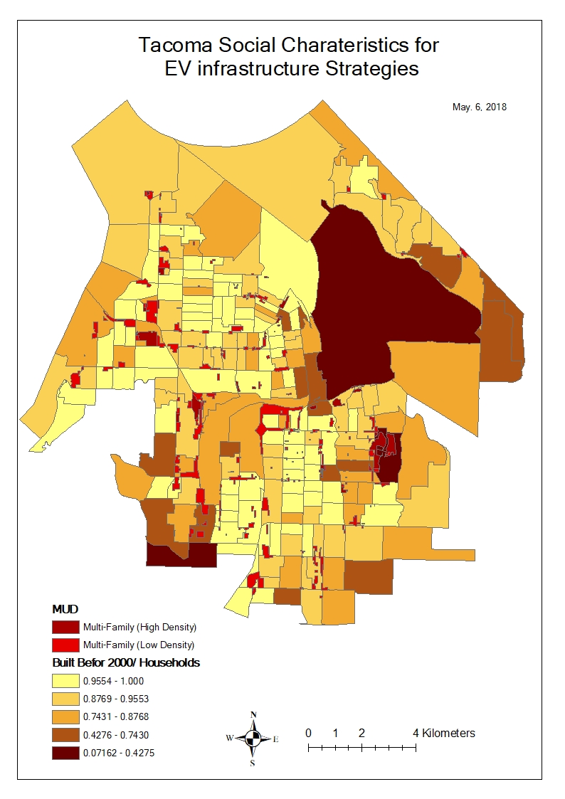
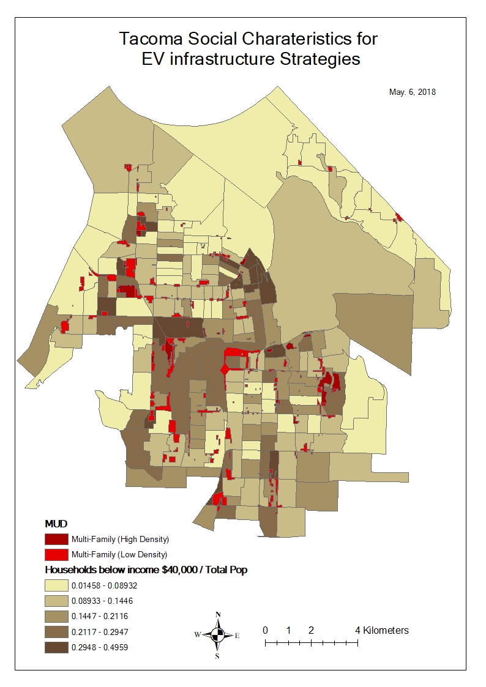
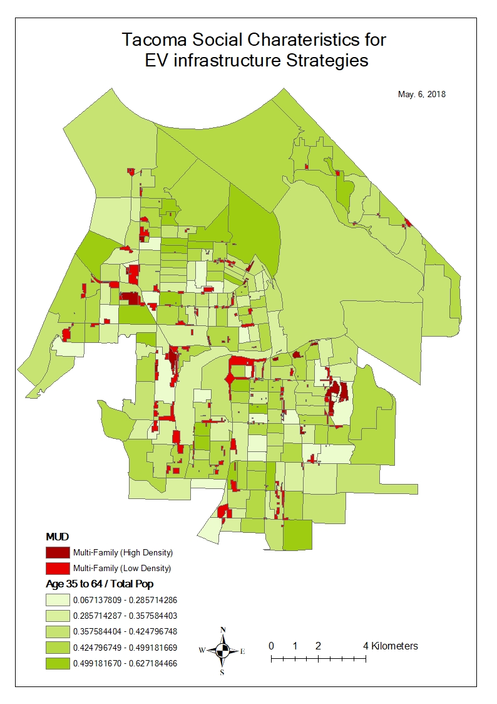
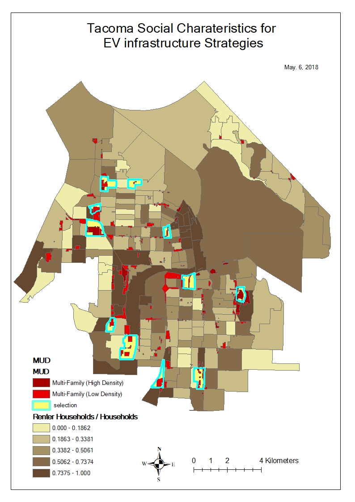

```{r setup, include=FALSE}
knitr::opts_chunk$set(echo = T,fig.pos="H")
```

# GIS social characteristics of Tacoma

It is known that EV onwers are more educated with higher income. Ye (2017) confirms, "Among the 15,408 survey respondents who specified their income, 77% had an annual household income of over $100,000. Among the 18,848 respondents who specified their education level, 34% of them obtained a Bachelor’s degree and 49% of them obtained a Graduate degree. Similarly, 81% of the respondents live in a single-family house; 75% of them are male, and 64% of them are white. According to this survey, EV owners are more likely to be male with relatively high income, possess a higher level of education attainment, and live in single family homes."

It is necessary in this regard to figure out the social characteristics of Tacoma for EV charger consideration. Hear are several maps showing them.










# Blocks with multi-family housings crossing the main area

A few blocks were chosen based on multi-family housings occupying the main area of the blocks. These blocks will be investigated against the rest of blocks to see any differences in terms of social characteristics.


14 variables (portion)

* Population density
* Male
* Age 35 to 64
* Non family household
* Education (Over bachelor)
* Rent household
* Median income
* Household income over $100,000
* Housing built before 2000
* Commuter more than 45 min to work
* Rent households with no vehicle
* Rent % income


{ height=800px }


In the scope of this study the social characteristics of different blocks in Tacoma were analyzed and blocks with MUDs are likely to have higher population density and a higher proportion of rental housing. Therefore, in order to achieve social equity in EVSE accessibility, the government should consider suitable charging solutions for MUDs in addition to public, workplace and single-family residence charging. Moreover, based on a performed cluster analysis, two clusters of MUD-intense blocks were found to have different social characteristics. Compared to Cluster 1, Cluster 2 has a higher population density, lower average income, lower education level, higher building age and a higher proportion of rental housing. The government needs to develop different strategies to address EVSE installations for the two clusters.


```{r}
dat<-read.csv("../data/raw/dat - Copy1.csv")
data= data.frame(matrix(NA,560,16))
data[,1]=dat[,2]
data[,2]=dat[,3]
data[,3]=dat[,6]
data[,4]=dat[,7]/dat[,5]
data[,5]=dat[,9]/dat[,5]
data[,6]=dat[,11]/dat[,5]
data[,7]=dat[,16]/dat[,14]
data[,8]=dat[,17]/dat[,14]
data[,9]=dat[,21]/dat[,18]
data[,10]=dat[,26]/dat[,14]
data[,11]=dat[,27]
data[,12]=dat[,32]/dat[,14]
data[,13]=dat[,36]/dat[,14]
data[,14]=dat[,38]
data[,15]=dat[,44]/dat[,42]
data[,16]=dat[,50]/dat[,49]
data[is.na(data)]=0
colnames(data)=c("Geoid","select","pop.density","male","age35_64","white","nonfamily","renter","master","over100,000","med.income","over20units","buitbf2000","rantpctincome","45min.commute","no.vechicle.renter")
# str(data)
```

```{r Fig1, fig.cap = "Independant variable plots", fig.height=20, fig.width=20}
pairs(data[-c(1,2)])

library(corrplot)
library(MASS)
```

```{r Fig2, fig.cap = "Correlations of indipendeant variables",fig.height=20, fig.width=20}
corrplot.mixed(cor(data[-c(1,2)]),upper="ellipse")
```

```{r message= FALSE, warning= FALSE}
M1 <- glm(as.factor(select)~ . -Geoid,data, family=binomial())
# stepAIC(M1)
M2 <- glm(formula = as.factor(select) ~ pop.density + nonfamily + renter + no.vechicle.renter, family = binomial(), data = data)
s=summary(M2)

library(kableExtra)
kable(coef(s), caption = "Binomial logistic model [note]", booktabs = T) %>%
  kable_styling(latex_options = c("hold_position")) %>%
  kable_styling(latex_options = c("striped", "scale_down"))%>%
  add_footnote(c("AIC is 95.92"), notation = "symbol")

```

It is estimated that more population density, more portion of rent housing with higher portion of no vehicle households, and less portion of non family households or more portion of family households are more likely correlated with blocks with more multi-family households.

Other regression model was built excluding the 3 erratic bock groups as below.

```{r message= FALSE, warning= FALSE}
data1 = data[-c(6,120,545),]
M1 <- glm(as.factor(select)~ . -Geoid,data1, family=binomial())
# stepAIC(M1)
M2 <- glm(formula = as.factor(select) ~ pop.density + renter, family = binomial(), data = data1)
s=summary(M2)

library(kableExtra)
kable(coef(s), caption = "Binomial logistic model [note]", booktabs = T) %>%
  kable_styling(latex_options = c("hold_position")) %>%
  kable_styling(latex_options = c("striped", "scale_down"))%>%
  add_footnote(c("AIC is 72.75"), notation = "symbol")
```

Population density and portion of rent households are the main factor for MUD characteristics in Tacoma.


# Factor and cluster analysis

To verify the characteristics of those blocks chosen above, factor and cluster analysis was performed. Two factors were chosen and the first factor (PA1) is related to the variables: "non-family households", "buiding units over 20", "rent households","population density","rent households with no vehicle","housings built before 2000 year" and the rest of variables are in the 2nd factor (PA2).


```{r message= FALSE, warning= FALSE}
library(psych)
library (cluster)
library(reshape)
library(ggplot2)
library(som)
library(GPArotation)

da = data[,-c(1,2)]
da = data.matrix(da)

fa.parallel(da,fa="both",n.iter=100)
fa <- fa(da,nfactors=2,rotate="promax",fm="pa")
dat1 <- fa$scores
factor.plot(fa, labels=rownames(fa$loadings))
fa.diagram(fa,simple=F)

# dim(da)

kmeans<-kmeans(dat1,center=2)
# kmeans
# summary(kmeans) # slots in kmeans object

set.seed(5099)
sum(kmeans(dat1,center=1)$withinss)
wss <- (nrow(dat1)-1)*sum(apply(dat1,2,var))
for (i in 2:9) wss[i] <- sum(kmeans(dat1,centers=i)$withinss)
plot(1:9, wss, type="b", xlab="Number of Clusters",ylab="Within groups sum of squares")

kmeans$centers # centroids of clusters
#number of samples in each cluster
table(kmeans$cluster)
kmeans$centers
Group1<-kmeans$centers[1,]
Group2<-kmeans$centers[2,]
plot(Group1,Group2,type="n")
text(Group1,Group2, labels=colnames(dat))
pairs(dat1, col=kmeans$cluster)
clusplot(dat1, kmeans$cluster, color=TRUE,shade=TRUE, labels=5, lines=0)

# library(rgl)
# plot3d(fa$scores, col = kmeans$cluster)

```

It is found the clusters are decided by the first factor (PA1). The first clustered group is more related to the higher value of PA1. Among the 11 chosen block groups with MUD, 3 block groups are clustered into the cluster 2nd group. We tried to go further analysis the difference between the 1st and the 2nd clustered group of the block groups chosen.

```{r}

GEOID_MUD = data[c(6,40,42,51,73,88,120,146,301,391,545),1]
GEOID_hetero = data[c(6,120,545), 1]

mud = data.frame(da[c(40,42,51,73,88,146,301,391),])
hetero = data.frame(da[c(6,120,545),])

par(mfrow=c(3,3))
for(i in 1:14) boxplot(mud[[i]], hetero[[i]], ylab= colnames(mud)[i], xlab="cluster 1, cluster 2")
```


```{r}
summary(mud)
summary(hetero)
```

It is also found the 2nd clustered group which has the lower value of PA1 has the noticeable characteristics with lower population density, lower non-family households, higher median income, lower unit in a building, etc.

This analysis is essential to make a decision to have EV chargers considering these different social characteristics with MUD especially addressing equity.


