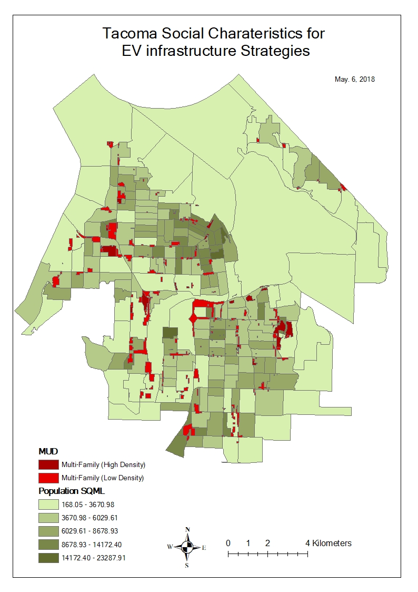
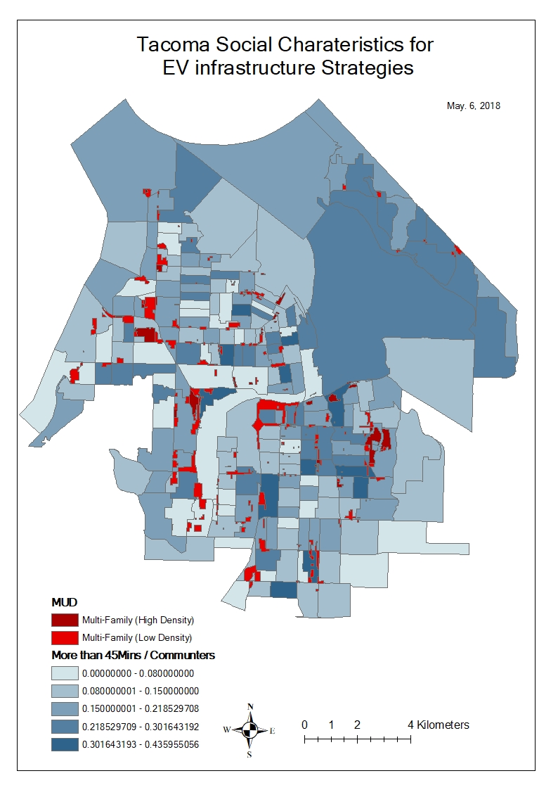
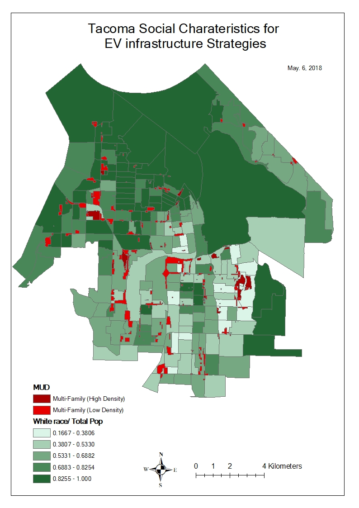

# GIS social characteristics of Tacoma

It is known that EV onwers are more educated with higher income. Ye (2017) confirms, "Among the 15,408 survey respondents who specified their income, 77% had an annual household income of over $100,000. Among the 18,848 respondents who specified their education level, 34% of them obtained a Bachelor’s degree and 49% of them obtained a Graduate degree. Similarly, 81% of the respondents live in a single-family house; 75% of them are male, and 64% of them are white. According to this survey, EV owners are more likely to be male with relatively high income, possess a higher level of education attainment, and live in single family homes."

It is necessary in this regard to figure out the social characteristics of Tacoma for EV charger consideration. Hear are several maps showing them.











# Blocks with multi-family housings crossing the main area

A few blocks were chosen based on multi-family housings occupying the main area of the blocks. These blocks will be investigated against the rest of blocks to see any differences in terms of social characteristics.


14 variables (portion)

* Population density
* Male
* Age 35 to 64
* Non family household
* Education (Over bachelor)
* Rent household
* Median income
* Household income over $100,000
* Housing built before 2000
* Commuter more than 45 min to work
* Rent households with no vehicle
* Rent % income


{ height=800px }


```r
dat<-read.csv("../data/raw/dat - Copy1.csv")
data= data.frame(matrix(NA,560,16))
data[,1]=dat[,2]
data[,2]=dat[,3]
data[,3]=dat[,6]
data[,4]=dat[,7]/dat[,5]
data[,5]=dat[,9]/dat[,5]
data[,6]=dat[,11]/dat[,5]
data[,7]=dat[,16]/dat[,14]
data[,8]=dat[,17]/dat[,14]
data[,9]=dat[,21]/dat[,18]
data[,10]=dat[,26]/dat[,14]
data[,11]=dat[,27]
data[,12]=dat[,32]/dat[,14]
data[,13]=dat[,36]/dat[,14]
data[,14]=dat[,38]
data[,15]=dat[,44]/dat[,42]
data[,16]=dat[,50]/dat[,49]
data[is.na(data)]=0
colnames(data)=c("Geoid","select","pop.density","male","age35_64","white","nonfamily","renter","master","over100,000","med.income","over20units","buitbf2000","rantpctincome","45min.commute","no.vechicle.renter")
# str(data)
```


```r
pairs(data[-c(1,2)])
```


```r
library(corrplot)
```

```
## corrplot 0.84 loaded
```

```r
library(MASS)
```


```r
corrplot.mixed(cor(data[-c(1,2)]),upper="ellipse")
```


```r
M1 <- glm(as.factor(select)~ . -Geoid,data, family=binomial())
# stepAIC(M1)
M2 <- glm(formula = as.factor(select) ~ pop.density + nonfamily + renter + no.vechicle.renter, family = binomial(), data = data)
s=summary(M2)

library(kableExtra)
kable(coef(s), format = "latex", caption = "Binomial logistic model [note]", booktabs = T) %>%
  kable_styling(latex_options = c("hold_position")) %>%
  kable_styling(latex_options = c("striped", "scale_down"))%>%
  add_footnote(c("AIC is 95.92"), notation = "symbol")
```

\rowcolors{2}{gray!6}{white}
\begin{table}[!h]

\caption{\label{tab:unnamed-chunk-2}Binomial logistic model \textsuperscript{*}}
\centering
\resizebox{\linewidth}{!}{
\begin{tabular}[t]{lrrrr}
\hiderowcolors
\toprule
  & Estimate & Std. Error & z value & Pr(>|z|)\\
\midrule
\showrowcolors
(Intercept) & -5.8072650 & 0.9263109 & -6.269240 & 0.0000000\\
pop.density & 0.0001583 & 0.0000768 & 2.061436 & 0.0392615\\
nonfamily & -3.6263804 & 2.0501884 & -1.768803 & 0.0769267\\
renter & 3.3332370 & 1.2661521 & 2.632572 & 0.0084741\\
no.vechicle.renter & 4.3534712 & 1.8372864 & 2.369512 & 0.0178116\\
\bottomrule
\multicolumn{5}{l}{\textsuperscript{*} AIC is 95.92}\\
\end{tabular}}
\end{table}
\rowcolors{2}{white}{white}

It is estimated that more population density, more portion of rent housing with higher portion of no vehicle households, and less portion of non family households or more portion of family households are more likely correlated with blocks with more multi-family households.

Other regression model was built excluding the 3 erratic bock groups as below.


```r
data1 = data[-c(6,120,545),]
M1 <- glm(as.factor(select)~ . -Geoid,data1, family=binomial())
# stepAIC(M1)
M2 <- glm(formula = as.factor(select) ~ pop.density + renter, family = binomial(), data = data1)
s=summary(M2)

library(kableExtra)
kable(coef(s), format = "latex", caption = "Binomial logistic model [note]", booktabs = T) %>%
  kable_styling(latex_options = c("hold_position")) %>%
  kable_styling(latex_options = c("striped", "scale_down"))%>%
  add_footnote(c("AIC is 72.75"), notation = "symbol")
```

\rowcolors{2}{gray!6}{white}
\begin{table}[!h]

\caption{\label{tab:unnamed-chunk-3}Binomial logistic model \textsuperscript{*}}
\centering
\resizebox{\linewidth}{!}{
\begin{tabular}[t]{lrrrr}
\hiderowcolors
\toprule
  & Estimate & Std. Error & z value & Pr(>|z|)\\
\midrule
\showrowcolors
(Intercept) & -7.0291502 & 1.0766785 & -6.528551 & 0.0000000\\
pop.density & 0.0001444 & 0.0000783 & 1.844661 & 0.0650868\\
renter & 3.7222820 & 1.5444505 & 2.410101 & 0.0159481\\
\bottomrule
\multicolumn{5}{l}{\textsuperscript{*} AIC is 72.75}\\
\end{tabular}}
\end{table}
\rowcolors{2}{white}{white}

Population density and portion of rent households are the main factor for MUD characteristics in Tacoma.


# Factor and cluster analysis

To verify the characteristics of those blocks chosen above, factor and cluster analysis was performed. Two factors were chosen and the first factor (PA1) is related to the variables: "non-family households", "buiding units over 20", "rent households","population density","rent households with no vehicle","housings built before 2000 year" and the rest of variables are in the 2nd factor (PA2).


```r
library(psych)
library (cluster)
library(reshape)
library(ggplot2)
library(som)
library(GPArotation)

da = data[,-c(1,2)]
da = data.matrix(da)

fa.parallel(da,fa="both",n.iter=100)
```

<!-- -->

```
## Parallel analysis suggests that the number of factors =  5  and the number of components =  3
```

```r
fa <- fa(da,nfactors=2,rotate="promax",fm="pa")
dat1 <- fa$scores
factor.plot(fa, labels=rownames(fa$loadings))
```

<!-- -->

```r
fa.diagram(fa,simple=F)
```

<!-- -->

```r
# dim(da)

kmeans<-kmeans(dat1,center=2)
# kmeans
# summary(kmeans) # slots in kmeans object

set.seed(5099)
sum(kmeans(dat1,center=1)$withinss)
```

```
## [1] 969.1251
```

```r
wss <- (nrow(dat1)-1)*sum(apply(dat1,2,var))
for (i in 2:9) wss[i] <- sum(kmeans(dat1,centers=i)$withinss)
plot(1:9, wss, type="b", xlab="Number of Clusters",ylab="Within groups sum of squares")
```

<!-- -->

```r
kmeans$centers # centroids of clusters
```

```
##          PA1        PA2
## 1 -0.5523910  0.5931719
## 2  0.7528367 -0.8084157
```

```r
#number of samples in each cluster
table(kmeans$cluster)
```

```
## 
##   1   2 
## 323 237
```

```r
kmeans$centers
```

```
##          PA1        PA2
## 1 -0.5523910  0.5931719
## 2  0.7528367 -0.8084157
```

```r
Group1<-kmeans$centers[1,]
Group2<-kmeans$centers[2,]
plot(Group1,Group2,type="n")
text(Group1,Group2, labels=colnames(dat))
```

<!-- -->

```r
pairs(dat1, col=kmeans$cluster)
```

<!-- -->

```r
clusplot(dat1, kmeans$cluster, color=TRUE,shade=TRUE, labels=5, lines=0)
```

<!-- -->

```r
# library(rgl)
# plot3d(fa$scores, col = kmeans$cluster)
```

It is found the clusters are decided by the first factor (PA1). The first clustered group is more related to the higher value of PA1. Among the 11 chosen block groups with MUD, 3 block groups are clustered into the cluster 2nd group. We tried to go further analysis the difference between the 1st and the 2nd clustered group of the block groups chosen.


```r
GEOID_MUD = data[c(6,40,42,51,73,88,120,146,301,391,545),1]
GEOID_hetero = data[c(6,120,545), 1]

mud = data.frame(da[c(40,42,51,73,88,146,301,391),])
hetero = data.frame(da[c(6,120,545),])

par(mfrow=c(3,3))
for(i in 1:14) boxplot(mud[[i]], hetero[[i]], ylab= colnames(mud)[i], xlab="cluster 1, cluster 2")
```

<!-- --><!-- -->


```r
summary(mud)
```

```
##   pop.density         male           age35_64          white       
##  Min.   : 3062   Min.   :0.3523   Min.   :0.1720   Min.   :0.4223  
##  1st Qu.: 5392   1st Qu.:0.4493   1st Qu.:0.2778   1st Qu.:0.4732  
##  Median : 8119   Median :0.4702   Median :0.3848   Median :0.5698  
##  Mean   : 8136   Mean   :0.4688   Mean   :0.3434   Mean   :0.5955  
##  3rd Qu.:10599   3rd Qu.:0.4974   3rd Qu.:0.4027   3rd Qu.:0.6908  
##  Max.   :12787   Max.   :0.5460   Max.   :0.4571   Max.   :0.8604  
##    nonfamily          renter           master          over100.000     
##  Min.   :0.2833   Min.   :0.4674   Min.   :0.003106   Min.   :0.02683  
##  1st Qu.:0.3104   1st Qu.:0.5332   1st Qu.:0.018097   1st Qu.:0.03581  
##  Median :0.4699   Median :0.6913   Median :0.031601   Median :0.10082  
##  Mean   :0.4288   Mean   :0.7194   Mean   :0.046371   Mean   :0.11098  
##  3rd Qu.:0.5166   3rd Qu.:0.9231   3rd Qu.:0.067806   3rd Qu.:0.17282  
##  Max.   :0.5400   Max.   :0.9787   Max.   :0.115686   Max.   :0.23667  
##    med.income     over20units       buitbf2000     rantpctincome  
##  Min.   :22727   Min.   :0.0000   Min.   :0.8405   Min.   :28.60  
##  1st Qu.:29696   1st Qu.:0.1211   1st Qu.:0.8879   1st Qu.:29.70  
##  Median :36070   Median :0.1542   Median :0.9551   Median :33.35  
##  Mean   :38050   Mean   :0.1639   Mean   :0.9331   Mean   :35.02  
##  3rd Qu.:45439   3rd Qu.:0.2114   3rd Qu.:0.9748   3rd Qu.:40.60  
##  Max.   :57031   Max.   :0.3256   Max.   :1.0000   Max.   :44.50  
##  X45min.commute    no.vechicle.renter
##  Min.   :0.06738   Min.   :0.05205   
##  1st Qu.:0.09991   1st Qu.:0.16511   
##  Median :0.10368   Median :0.20556   
##  Mean   :0.14269   Mean   :0.21595   
##  3rd Qu.:0.14302   3rd Qu.:0.25659   
##  Max.   :0.31761   Max.   :0.39344
```

```r
summary(hetero)
```

```
##   pop.density         male           age35_64          white       
##  Min.   : 3221   Min.   :0.4653   Min.   :0.2788   Min.   :0.1667  
##  1st Qu.: 4304   1st Qu.:0.4805   1st Qu.:0.3467   1st Qu.:0.3637  
##  Median : 5387   Median :0.4957   Median :0.4145   Median :0.5606  
##  Mean   : 6328   Mean   :0.5067   Mean   :0.3814   Mean   :0.5516  
##  3rd Qu.: 7881   3rd Qu.:0.5275   3rd Qu.:0.4328   3rd Qu.:0.7440  
##  Max.   :10374   Max.   :0.5592   Max.   :0.4510   Max.   :0.9274  
##    nonfamily          renter            master         over100.000    
##  Min.   :0.2004   Min.   :0.09643   Min.   :0.01205   Min.   :0.1206  
##  1st Qu.:0.2124   1st Qu.:0.37626   1st Qu.:0.03004   1st Qu.:0.1554  
##  Median :0.2244   Median :0.65610   Median :0.04803   Median :0.1902  
##  Mean   :0.2499   Mean   :0.49663   Mean   :0.11796   Mean   :0.2762  
##  3rd Qu.:0.2747   3rd Qu.:0.69673   3rd Qu.:0.17092   3rd Qu.:0.3541  
##  Max.   :0.3250   Max.   :0.73735   Max.   :0.29380   Max.   :0.5179  
##    med.income      over20units        buitbf2000     rantpctincome  
##  Min.   : 21250   Min.   :0.00000   Min.   :0.1070   Min.   :31.30  
##  1st Qu.: 39518   1st Qu.:0.03502   1st Qu.:0.4242   1st Qu.:33.40  
##  Median : 57786   Median :0.07004   Median :0.7415   Median :35.50  
##  Mean   : 59956   Mean   :0.07782   Mean   :0.6162   Mean   :35.07  
##  3rd Qu.: 79310   3rd Qu.:0.11673   3rd Qu.:0.8707   3rd Qu.:36.95  
##  Max.   :100833   Max.   :0.16341   Max.   :1.0000   Max.   :38.40  
##  X45min.commute    no.vechicle.renter
##  Min.   :0.06771   Min.   :0.03346   
##  1st Qu.:0.10956   1st Qu.:0.16488   
##  Median :0.15142   Median :0.29630   
##  Mean   :0.14371   Mean   :0.21458   
##  3rd Qu.:0.18171   3rd Qu.:0.30514   
##  Max.   :0.21199   Max.   :0.31398
```

It is also found the 2nd clustered group which has the lower value of PA1 has the noticeable characteristics with lower population density, lower non-family households, higher median income, lower unit in a building, etc.

This analysis is essential to make a decision to have EV chargers considering these different social characteristics with MUD especially addressing equity.


