# Cost-benefit analysis of charger

It is necessary to analyze how much would it benefit from installation of one charger. The benefit could be estimated by the fuel cost reduction as EV uses electricity. Assumping electricity price and gas price keep changing annually and annual discount factor is 6%, the cost - benefit analyses were constructed based on 4 cases. 1) onwer takes the installation cost of 1 charger and uses it, 2) owner takes the installation cost for the whole chargers (5 renters) and uses one of them, 3) owner doesn't live in the building, but pays the cost of all chargers (6 chargers) and get commission of 20% of the benefit generated from the chargers, and 4) with the case 3, there are additional 6 more EVs are using by sharing the 6 installed chargers. Net present value (NPV) and discounted payback period (DPP) are measured for each scenario. 


To assess how rebates can be applied in the proposed policies, it needed to be analyzed how the expected benefits through the installation of a charger compare to their cost and calculate a break-even point. This analysis assumes EV-ready buildings and will be based on the outcome of the previous sections and the fuel cost reduction achieved by using EVs, plus the installation cost of the chargers. This break-even point heavily depends on the individual situation (condos, apartments, owner-renter relationships, etc.). Assuming annual changes of gasoline and energy prices and an annual discount factor of 6%, four different example cases were provided:

* Case 1: Condo - Owner invests into the installation of one charger for personal use
* Case 2: Mixed Condo / Rental apartments (condo owner owns 5 additional units in the building and rents them out to tenants) - Owner invests into multiple chargers and uses one of them
* Case 3: Rental apartments - Landlord invests into a set of chargers (in this case we assume 6 chargers), while not using any of them for personal use and receiving a commission of 20% of the benefits generated through the chargers
* Case 4: Rental apartments - Sharing chargers with case 3 above - 12 renters are sharing 6 installed chargers (2 renters share 1 charger)

These cases all assume that the installed chargers will be used such that the upfront cost for a charger (level 2 stands alone) is \$2,050 for charger ready sites. The net present value (NPV) and discounted payback period (DPP) were measured for each scenario. We assume the annual vehicle miles travelled to be 10,230 miles per vehicle and an average MPG of 33 according to the standard applied to the year 2017. Thus, an internal combustion engine (ICE) vehicle requires 310 gallons of fuel on average per year. The total cost was calculated to be \$772 per year based in a fuel price of \$2.49 / gallon. For EVs we assume the same mileage and a fuel economy of 30 kWh / 100 miles (34 kWh/ 100 miles for Tesla models S - 90D, 30 kWh/ 100 miles for Nissan Leaf, 32 kWh/ 100 miles for Kia Soul). Thus, the annual energy requirement is 3069 kWh. Based on a price of \$0.077/kWh the annual cost is calculated as \$236.30, which results in an annual benefit in operational cost of \$535.70 per EV. For case 1, we achieve break-even within less than 6 years, which is reasonable as the investor directly receives their Return-On-Investment (ROI). In each case, Net present value (NPV), present value (PV) and future value (FV) would be measured. This is a case comparable to single family housing EVSE.


## Benefits

### Conventional vehicle
* VMT 10,230 miles
* MPG 33 miles/ gallon
* Gas required 310 gallons
* Gas unit price $2.49/ gallon
* Total cost $772

### EV
* Fuel economy 30 kWh/100 mile
* Elec. need per year 3069 kWh
* Elec. unit cost $0.077/ kWh
* Elec. cost $236.3

**Annual benefit for one car $535.7**
 
### Cost 
* Installation $2,050 (based on Megan's table)

After 100 times Monte Carlo simulations, it shows that case 1 takes less than 6 years to reach the break-even point, while case 2, over 20 years and case 3, about 18 years. This analysis indicates that government supports are necessary to benefit buiding owners for the same impact as the single family households. 

Moreover, MUD charger has potential as one charger could serve muliple EVs. The case 4 shows that it only takes about 10 years to reach the break-even point. Government support could be lessen compared to the case 3. 


```r
vmt=10230
mpg=33
gas=vmt/mpg
gas_c=2.49
c_cost=gas_c*gas

kw=3069
u_cost=0.077
e_cost=kw*u_cost

ben=c_cost-e_cost

inst=2050

rt=0.06
```


## case1, single owner - single user


```r
npv = c()
dpp = c()

for(j in 1:100){
  rgs=gas_c
  rei=u_cost
  cf=-inst
  q=data.frame(matrix(NA,25,6))
  for(i in 1:25){
    rgs = rgs*(1+runif(1,0.07,0.1)) #annual gas price increase
    rei = rei*(1+runif(1,0.07,0.1)) #annual elec. price increase
    fv=rgs*gas - kw*rei
    pv= fv/(1+rt)^i
    old=cf
    cf=cf+pv
    dp=ifelse(cf>0,i-1+abs(old/pv),0)
    q[i,]=c(rgs,rei,fv,pv,cf,dp)
  }
  npv[j]=sum(q[,4])-inst #net present value
  dpp[j]=min(q[,6][q[,6]>0]) #discounted payback period
}
plot(npv)
```

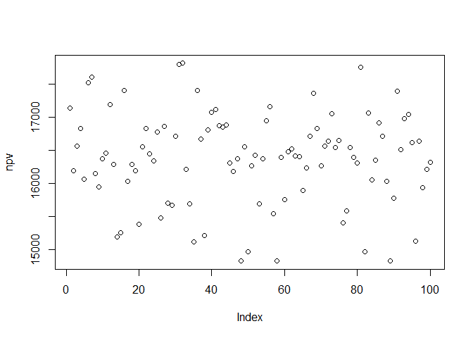<!-- -->

```r
plot(dpp)
```

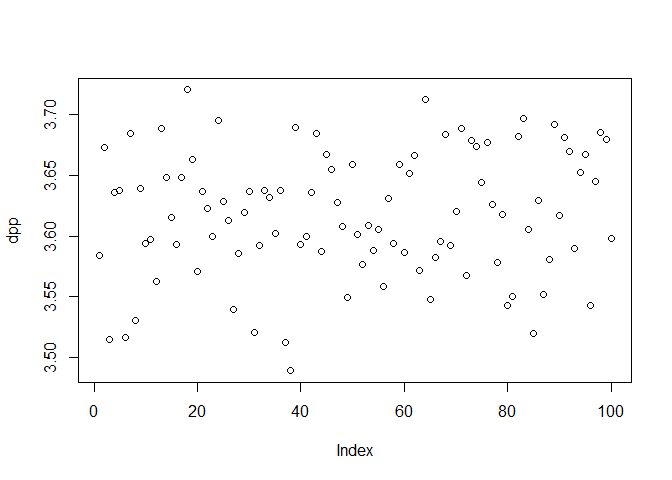<!-- -->

```r
colnames(q) = c("Gas price($/gallon)","Elec.price($/kWh)","FV($)","PV($)","NPV($)","DPP(year)")
q
```

```
##    Gas price($/gallon) Elec.price($/kWh)     FV($)    PV($)     NPV($)
## 1             2.713950        0.08350767  585.0395 551.9241 -1498.0759
## 2             2.933360        0.09046836  631.6943 562.2057  -935.8702
## 3             3.140118        0.09793842  672.8635 564.9491  -370.9210
## 4             3.443515        0.10727831  738.2527 584.7652   213.8442
## 5             3.740426        0.11536638  805.4727 601.8961   815.7403
## 6             4.020305        0.12423240  865.0252 609.8086  1425.5489
## 7             4.364249        0.13414477  941.2269 625.9697  2051.5186
## 8             4.794454        0.14674097 1035.9328 649.9570  2701.4756
## 9             5.203989        0.16068358 1120.0986 662.9846  3364.4602
## 10            5.713674        0.17509121 1233.8839 688.9943  4053.4546
## 11            6.149322        0.18798665 1329.3588 700.2896  4753.7442
## 12            6.587763        0.20443637 1414.7914 703.1080  5456.8522
## 13            7.130872        0.22043373 1534.0591 719.2268  6176.0789
## 14            7.642117        0.24049060 1630.9907 721.3887  6897.4677
## 15            8.266553        0.25898164 1767.8168 737.6482  7635.1159
## 16            8.897051        0.28278695 1890.2125 744.0751  8379.1910
## 17            9.714691        0.30760993 2067.4994 767.7957  9146.9867
## 18           10.461719        0.33813529 2205.3957 772.6467  9919.6334
## 19           11.230042        0.36908434 2348.5931 776.2406 10695.8740
## 20           12.229757        0.39988168 2563.9879 799.4636 11495.3375
## 21           13.166721        0.43177603 2756.5628 810.8578 12306.1954
## 22           14.097509        0.46804094 2933.8102 814.1473 13120.3427
## 23           15.196055        0.51455423 3131.6102 819.8470 13940.1897
## 24           16.325064        0.56231587 3335.0225 823.6790 14763.8687
## 25           17.687709        0.60457645 3627.7448 845.2596 15609.1282
##    DPP(year)
## 1   0.000000
## 2   0.000000
## 3   0.000000
## 4   3.634308
## 5   4.355284
## 6   6.337699
## 7   8.277345
## 8  10.156391
## 9  12.074718
## 10 13.883146
## 11 15.788254
## 12 17.761044
## 13 19.587109
## 14 21.561374
## 15 23.350620
## 16 25.261216
## 17 26.913308
## 18 28.838511
## 19 30.779071
## 20 32.378814
## 21 34.176761
## 22 36.115441
## 23 38.003404
## 24 39.924299
## 25 41.466669
```

```r
mean(npv)
```

```
## [1] 16264.6
```

```r
mean(dpp)
```

```
## [1] 3.618864
```

```r
par(mfrow= c(1,1))
plot(q[,3], main = "Cash flow", ylab="$", xlab="year",
     type = 'l', ylim = c(min(q[,5]),max(q[,5])), col = 'red',lwd=3,cex.main=0.9)
lines(q[,4], type = 'l', col='blue',lwd=3)
lines(q[,5], type = 'l', col='orange',lwd=3)
legend("bottomright", legend=c("Annual FV","Annual PV","NPV"),col=c("red","blue","orange"), lty=1, box.lty = 0, lwd=7,cex=0.9)
```

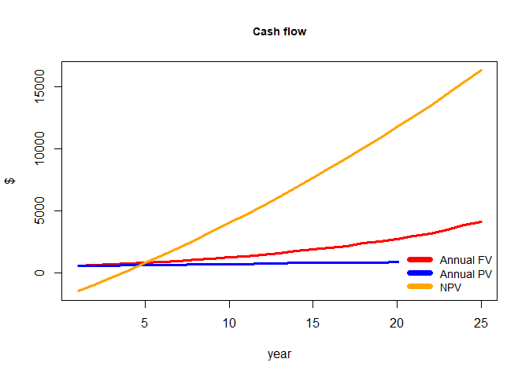<!-- -->

```r
par(mfrow= c(1,2))
plot(q[,1], main = "Gas price", ylab="$/gallon", xlab="year",
     type = 'l', ylim = c(min(q[,1]),max(q[,1])), col = 'red',lwd=3,cex.main=0.9)

plot(q[,2], main = "Electricity price", ylab="$/kWh", xlab="year",
     type = 'l', ylim = c(min(q[,2]),max(q[,2])), col = 'red',lwd=3,cex.main=0.9)
```

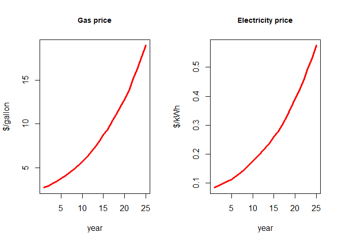<!-- -->


## case2, one owner - 5 renters 


```r
npv = c()
dpp = c()

for(j in 1:100){
  rgs=gas_c
  rei=u_cost
  cf=-inst * 6 
  q=data.frame(matrix(NA,30,6))
  for(i in 1:30){
    rgs = rgs*(1+runif(1,0.07,0.1)) #annual gas price increase
    rei = rei*(1+runif(1,0.07,0.1)) #annual elec. price increase
    fv=rgs*gas - kw*rei
    pv= fv/(1+rt)^i
    old=cf
    cf=cf+pv
    dp=ifelse(cf>0,i-1+abs(old/pv),0)
    q[i,]=c(rgs,rei,fv,pv,cf,dp)
  }
  npv[j]=sum(q[,4])-inst #net present value
  dpp[j]=min(q[,6][q[,6]>0]) #discounted payback period
}
plot(npv)
```

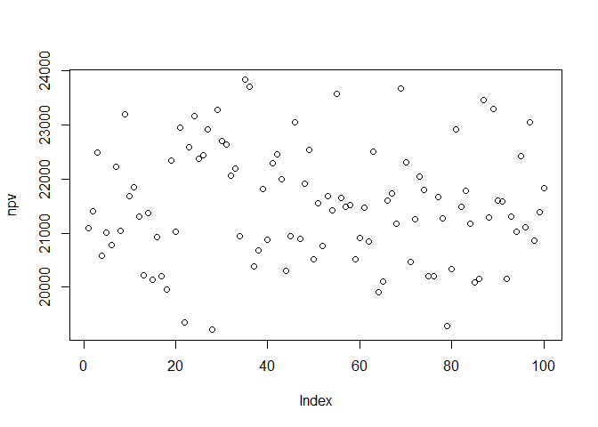<!-- -->

```r
plot(dpp)
```

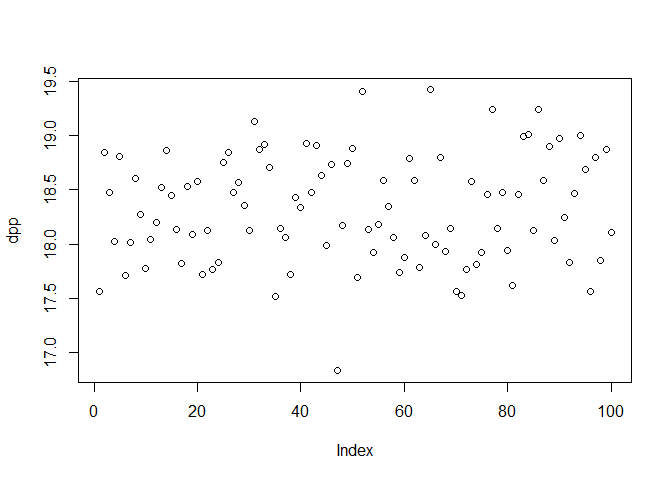<!-- -->

```r
colnames(q) = c("Gas price($/gallon)","Elec.price($/kWh)","FV($)","PV($)","NPV($)","DPP(year)")
q
```

```
##    Gas price($/gallon) Elec.price($/kWh)     FV($)     PV($)      NPV($)
## 1             2.675063        0.08244268  576.2531  543.6350 -11756.3650
## 2             2.892745        0.08904304  623.4780  554.8932 -11201.4718
## 3             3.134253        0.09747973  672.4531  564.6046 -10636.8672
## 4             3.417908        0.10438769  739.1857  585.5043 -10051.3629
## 5             3.692211        0.11389638  795.0374  594.0982  -9457.2647
## 6             4.027657        0.12377178  868.7181  612.4120  -8844.8527
## 7             4.327502        0.13469845  928.1362  617.2635  -8227.5892
## 8             4.699952        0.14421411 1014.3921  636.4422  -7591.1470
## 9             5.047259        0.15575471 1086.6390  643.1799  -6947.9671
## 10            5.522858        0.16848906 1194.9929  667.2778  -6280.6893
## 11            6.010408        0.18199014 1304.6988  687.2990  -5593.3902
## 12            6.597440        0.19642042 1442.3920  716.8246  -4876.5656
## 13            7.070190        0.21378934 1535.6393  719.9676  -4156.5980
## 14            7.681911        0.23515150 1659.7125  734.0925  -3422.5055
## 15            8.442274        0.25757190 1826.6167  762.1833  -2660.3222
## 16            9.047831        0.28299591 1936.3132  762.2225  -1898.0997
## 17            9.714562        0.31120640 2056.4219  763.6819  -1134.4178
## 18           10.627246        0.34230152 2243.9228  786.1444   -348.2734
## 19           11.395576        0.37062375 2395.1843  791.6396    443.3662
## 20           12.410469        0.39671398 2629.7302  819.9623   1263.3285
## 21           13.565842        0.43214856 2879.1471  846.9167   2110.2452
## 22           14.611062        0.46738754 3095.0168  858.8829   2969.1281
## 23           15.874250        0.50082619 3383.9819  885.9172   3855.0453
## 24           17.349046        0.53909345 3723.7263  919.6805   4774.7258
## 25           18.791318        0.57986739 4045.6954  942.6415   5717.3673
## 26           20.263901        0.62689877 4357.8569  957.9006   6675.2680
## 27           21.742211        0.67166508 4678.7452  970.2218   7645.4898
## 28           23.829169        0.72588189 5159.3110 1009.3167   8654.8065
## 29           25.925065        0.79299609 5603.0652 1034.0834   9688.8900
## 30           28.136441        0.86454398 6069.0111 1056.6763  10745.5663
##    DPP(year)
## 1    0.00000
## 2    0.00000
## 3    0.00000
## 4    0.00000
## 5    0.00000
## 6    0.00000
## 7    0.00000
## 8    0.00000
## 9    0.00000
## 10   0.00000
## 11   0.00000
## 12   0.00000
## 13   0.00000
## 14   0.00000
## 15   0.00000
## 16   0.00000
## 17   0.00000
## 18   0.00000
## 19  18.43994
## 20  19.54072
## 21  21.49168
## 22  23.45696
## 23  25.35147
## 24  27.19172
## 25  29.06526
## 26  30.96864
## 27  32.88015
## 28  34.57492
## 29  36.36954
## 30  38.16921
```

```r
mean(npv)
```

```
## [1] 21450.79
```

```r
mean(dpp)
```

```
## [1] 18.25443
```

```r
par(mfrow= c(1,1))
plot(q[,3], main = "Cash flow", ylab="$", xlab="year",
     type = 'l', ylim = c(min(q[,5]),max(q[,5])), col = 'red',lwd=3,cex.main=0.9)
lines(q[,4], type = 'l', col='blue',lwd=3)
lines(q[,5], type = 'l', col='orange',lwd=3)
legend("bottomright", legend=c("Annual FV","Annual PV","NPV"),col=c("red","blue","orange"), lty=1, box.lty = 0, lwd=7,cex=0.9)
```

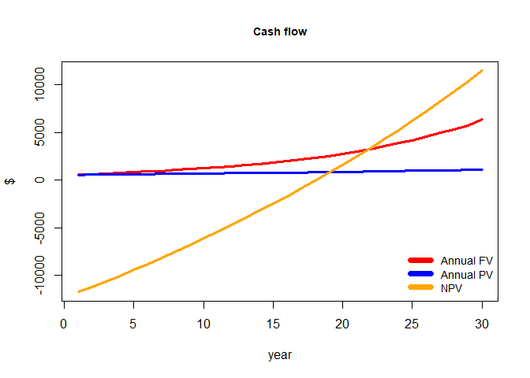<!-- -->

```r
par(mfrow= c(1,2))
plot(q[,1], main = "Gas price", ylab="$/gallon", xlab="year",
     type = 'l', ylim = c(min(q[,1]),max(q[,1])), col = 'red',lwd=3,cex.main=0.9)

plot(q[,2], main = "Electricity price", ylab="$/kWh", xlab="year",
     type = 'l', ylim = c(min(q[,2]),max(q[,2])), col = 'red',lwd=3,cex.main=0.9)
```

<!-- -->


## case3, no onwer but only 6 renters living 

Here it is assumed that the owner doesn't live in the building while collecting a commission of 20% of profit generated from the charger installation. This commission could be interpreted as the increased rental or tax credits if government supports. 


```r
npv = c()
dpp = c()
com = 0.2

for(j in 1:100){
  rgs=gas_c
  rei=u_cost
  cf=-inst * 6
  q=data.frame(matrix(NA,30,6))
  for(i in 1:30){
    rgs = rgs*(1+runif(1,0.07,0.1)) #annual gas price increase
    rei = rei*(1+runif(1,0.07,0.1)) #annual elec. price increase
    fv=com*6*(rgs*gas - kw*rei)
    pv= fv/(1+rt)^i
    old=cf
    cf=cf+pv
    dp=ifelse(cf>0,i-1+abs(old/pv),0)
    q[i,]=c(rgs,rei,fv,pv,cf,dp)
  }
  npv[j]=sum(q[,4])-inst #net present value
  dpp[j]=min(q[,6][q[,6]>0]) #discounted payback period
}
plot(npv)
```

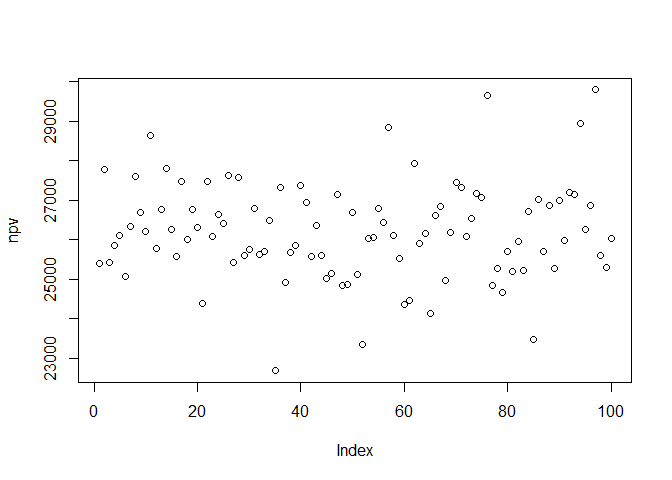<!-- -->

```r
plot(dpp)
```

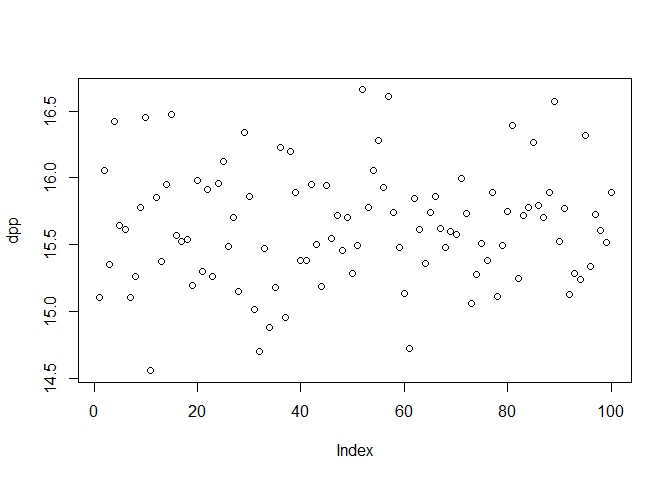<!-- -->

```r
colnames(q) = c("Gas price($/gallon)","Elec.price($/kWh)","FV($)","PV($)","NPV($)","DPP(year)")
q
```

```
##    Gas price($/gallon) Elec.price($/kWh)     FV($)     PV($)      NPV($)
## 1             2.738685        0.08391385  709.7530  669.5783 -11630.4217
## 2             2.937743        0.09025670  760.4432  676.7917 -10953.6300
## 3             3.183005        0.09922741  818.6433  687.3487 -10266.2813
## 4             3.493371        0.10781067  902.4888  714.8556  -9551.4257
## 5             3.841512        0.11607677 1001.5551  748.4203  -8803.0054
## 6             4.151975        0.12752903 1074.8708  757.7415  -8045.2640
## 7             4.541576        0.13819835 1180.5096  785.1063  -7260.1577
## 8             4.934184        0.14885229 1287.3231  807.6825  -6452.4752
## 9             5.316015        0.16120937 1383.8557  819.1021  -5633.3731
## 10            5.717203        0.17656515 1476.5454  824.4952  -4808.8779
## 11            6.184050        0.19390876 1586.3393  835.6638  -3973.2142
## 12            6.719217        0.20965786 1727.4209  858.4753  -3114.7389
## 13            7.245545        0.22784101 1856.2499  870.2824  -2244.4565
## 14            7.797736        0.24842851 1985.8452  878.3412  -1366.1152
## 15            8.472096        0.26583578 2172.5998  906.5500   -459.5652
## 16            9.240697        0.28445234 2389.9584  940.7982    481.2330
## 17           10.028736        0.30813862 2595.8768  964.0163   1445.2493
## 18           10.950993        0.33081591 2855.4406 1000.3859   2445.6351
## 19           11.917708        0.35844400 3113.3097 1028.9893   3474.6245
## 20           13.098178        0.38489038 3455.0479 1077.3003   4551.9247
## 21           14.367899        0.41190776 3827.8847 1125.9930   5677.9177
## 22           15.430893        0.44748405 4092.2981 1135.6336   6813.5513
## 23           16.513288        0.48598208 4353.1682 1139.6475   7953.1988
## 24           17.846509        0.52135340 4718.8612 1165.4575   9118.6563
## 25           19.215540        0.56731406 5058.8767 1178.7113  10297.3676
## 26           21.089651        0.61338936 5586.3598 1227.9379  11525.3055
## 27           22.712088        0.65812444 6025.1560 1249.4243  12774.7298
## 28           24.566770        0.72247135 6478.1208 1267.3157  14042.0455
## 29           26.970624        0.79056882 7121.5654 1314.3329  15356.3784
## 30           29.534527        0.86533831 7799.9759 1358.0548  16714.4332
##    DPP(year)
## 1    0.00000
## 2    0.00000
## 3    0.00000
## 4    0.00000
## 5    0.00000
## 6    0.00000
## 7    0.00000
## 8    0.00000
## 9    0.00000
## 10   0.00000
## 11   0.00000
## 12   0.00000
## 13   0.00000
## 14   0.00000
## 15   0.00000
## 16  15.48848
## 17  16.49920
## 18  18.44469
## 19  20.37674
## 20  22.22531
## 21  24.04259
## 22  25.99978
## 23  27.97865
## 24  29.82410
## 25  31.73612
## 26  33.38590
## 27  35.22449
## 28  37.08015
## 29  38.68378
## 30  40.30763
```

```r
mean(npv)
```

```
## [1] 26297.23
```

```r
mean(dpp)
```

```
## [1] 15.65389
```

```r
par(mfrow= c(1,1))
plot(q[,3], main = "Cash flow", ylab="$", xlab="year",
     type = 'l', ylim = c(min(q[,5]),max(q[,5])), col = 'red',lwd=3,cex.main=0.9)
lines(q[,4], type = 'l', col='blue',lwd=3)
lines(q[,5], type = 'l', col='orange',lwd=3)
legend("bottomright", legend=c("Annual FV","Annual PV","NPV"),col=c("red","blue","orange"), lty=1, box.lty = 0, lwd=7,cex=0.9)
```

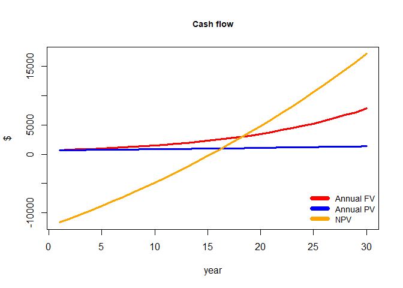<!-- -->

```r
par(mfrow= c(1,2))
plot(q[,1], main = "Gas price", ylab="$/gallon", xlab="year",
     type = 'l', ylim = c(min(q[,1]),max(q[,1])), col = 'red',lwd=3,cex.main=0.9)

plot(q[,2], main = "Electricity price", ylab="$/kWh", xlab="year",
     type = 'l', ylim = c(min(q[,2]),max(q[,2])), col = 'red',lwd=3,cex.main=0.9)
```

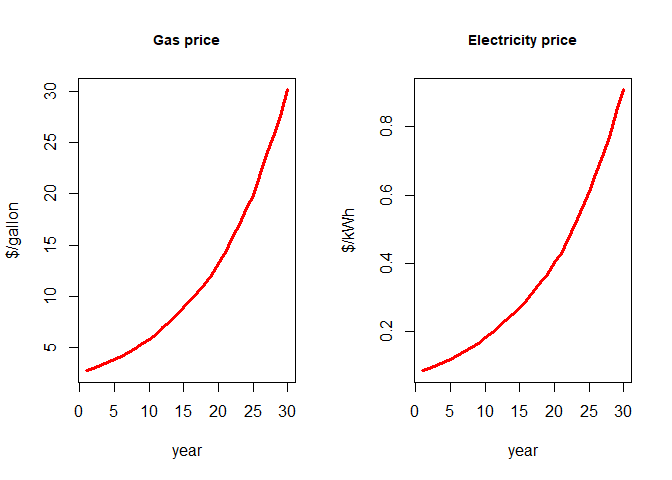<!-- -->

## case4, 12 renters (sharing chargers) but rest conditions are the same as case3. 

This case, 2 EV owners are using one charger by sharing it given the same utilization rate as the case3. 


```r
npv = c()
dpp = c()
com = 0.2

for(j in 1:100){
  rgs=gas_c
  rei=u_cost
  cf=-inst * 6
  q=data.frame(matrix(NA,20,6))
  for(i in 1:20){
    rgs = rgs*(1+runif(1,0.07,0.1)) #annual gas price increase
    rei = rei*(1+runif(1,0.07,0.1)) #annual elec. price increase
    fv=com*12*(rgs*gas - kw*rei)
    pv= fv/(1+rt)^i
    old=cf
    cf=cf+pv
    dp=ifelse(cf>0,i-1+abs(old/pv),0)
    q[i,]=c(rgs,rei,fv,pv,cf,dp)
  }
  npv[j]=sum(q[,4])-inst #net present value
  dpp[j]=min(q[,6][q[,6]>0]) #discounted payback period
}
plot(npv)
```

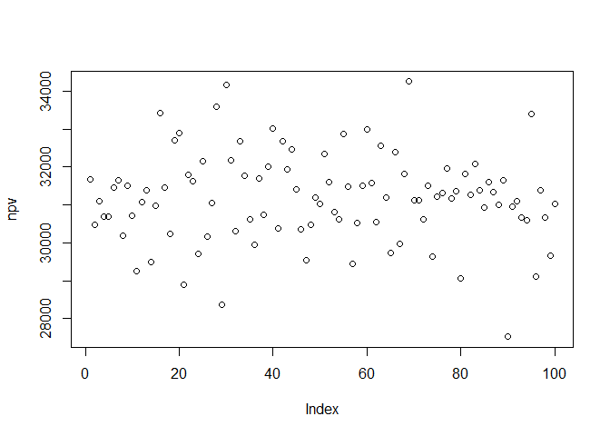<!-- -->

```r
plot(dpp)
```

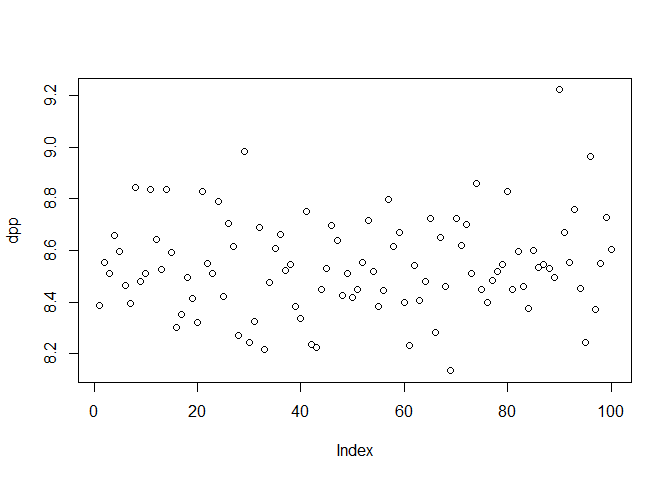<!-- -->

```r
colnames(q) = c("Gas price($/gallon)","Elec.price($/kWh)","FV($)","PV($)","NPV($)","DPP(year)")
q
```

```
##    Gas price($/gallon) Elec.price($/kWh)    FV($)    PV($)      NPV($)
## 1             2.695466        0.08421467 1385.135 1306.731 -10993.2687
## 2             2.953279        0.09136912 1524.251 1356.578  -9636.6905
## 3             3.171540        0.09899311 1630.482 1368.984  -8267.7064
## 4             3.395626        0.10785769 1731.909 1371.834  -6895.8723
## 5             3.643653        0.11701332 1849.004 1381.684  -5514.1887
## 6             3.919290        0.12751787 1976.706 1393.500  -4120.6889
## 7             4.247798        0.13661548 2154.107 1432.604  -2688.0847
## 8             4.567466        0.14818207 2306.745 1447.280  -1240.8046
## 9             4.910619        0.15978137 2476.615 1465.905    225.0999
## 10            5.327987        0.17514087 2674.005 1493.150   1718.2503
## 11            5.769266        0.19044170 2889.616 1522.214   3240.4642
## 12            6.181020        0.20695775 3074.311 1527.838   4768.3024
## 13            6.655814        0.22595204 3287.654 1541.380   6309.6827
## 14            7.161195        0.24279983 3539.562 1565.552   7875.2346
## 15            7.755220        0.26246971 3836.637 1600.894   9476.1291
## 16            8.416536        0.28815049 4139.501 1629.499  11105.6283
## 17            9.156643        0.31581457 4486.378 1666.081  12771.7096
## 18           10.032085        0.34580307 4916.824 1722.579  14494.2885
## 19           10.950524        0.37469114 5387.365 1780.594  16274.8826
## 20           11.717799        0.40371548 5744.435 1791.142  18066.0247
##    DPP(year)
## 1   0.000000
## 2   0.000000
## 3   0.000000
## 4   0.000000
## 5   0.000000
## 6   0.000000
## 7   0.000000
## 8   0.000000
## 9   8.846443
## 10  9.150755
## 11 11.128784
## 12 13.120947
## 13 15.093528
## 14 17.030325
## 15 18.919271
## 16 20.815363
## 17 22.665718
## 18 24.414296
## 19 26.140142
## 20 28.086316
```

```r
mean(npv)
```

```
## [1] 31149.02
```

```r
mean(dpp)
```

```
## [1] 8.539443
```

```r
par(mfrow= c(1,1))
plot(q[,3], main = "Cash flow", ylab="$", xlab="year",
     type = 'l', ylim = c(min(q[,5]),max(q[,5])), col = 'red',lwd=3,cex.main=0.9)
lines(q[,4], type = 'l', col='blue',lwd=3)
lines(q[,5], type = 'l', col='orange',lwd=3)
legend("bottomright", legend=c("Annual FV","Annual PV","NPV"),col=c("red","blue","orange"), lty=1, box.lty = 0, lwd=7,cex=0.9)
```

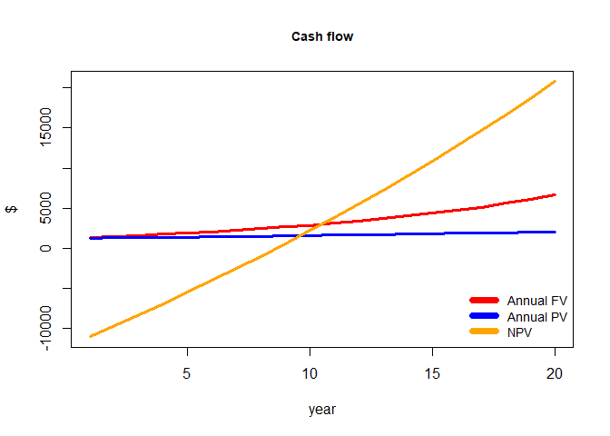<!-- -->

```r
par(mfrow= c(1,2))
plot(q[,1], main = "Gas price", ylab="$/gallon", xlab="year",
     type = 'l', ylim = c(min(q[,1]),max(q[,1])), col = 'red',lwd=3,cex.main=0.9)

plot(q[,2], main = "Electricity price", ylab="$/kWh", xlab="year",
     type = 'l', ylim = c(min(q[,2]),max(q[,2])), col = 'red',lwd=3,cex.main=0.9)
```

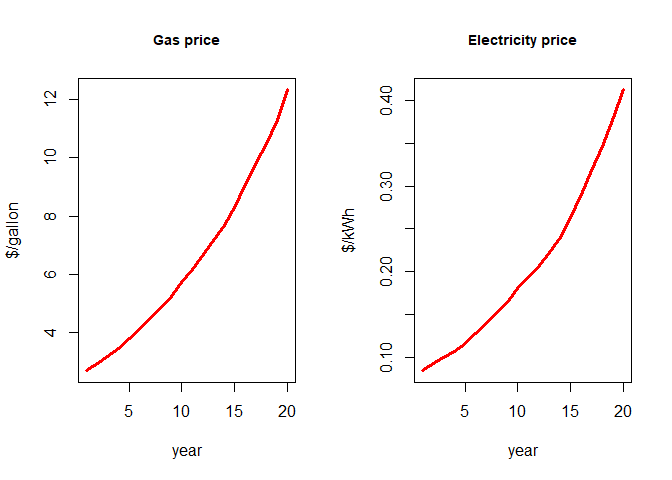<!-- -->


# Commission vs. Incentive 

As the previous cost benefit analysis shows, in order to make the investment of chargers as
effective as for single family households, there should be support to MUD owners who need to
invest their private funds for the installation of chargers. Taking into account the previous case
analysis, a DPP of 5 years should be targeted if we aim at achieving a similar benefit as for
case 1. This section investigates how high the incentives would have to be to achieve this goal
for case 2, case 3 and case 4.

For case 2, the incentive would have to be at least 80% of the upfront cost. A figure below shows
that an incentive of 50% would still not be enough.


```r
npv = c()
dpp = c()
for(j in 1:100){
rgs=gas_c
rei=u_cost
cf=-inst *6*0.5
q=data.frame(matrix(NA,30,6))
for(i in 1:30){
rgs = rgs*(1+runif(1,0.07,0.1)) #annual gas price increase
rei = rei*(1+runif(1,0.07,0.1)) #annual elec. price increase
fv=(rgs*gas - kw*rei)
pv= fv/(1+rt)^i
old=cf
cf=cf+pv
dp=ifelse(cf>0,i-1+abs(old/pv),0)
q[i,]=c(rgs,rei,fv,pv,cf,dp)
}
npv[j]=sum(q[,4])-inst #net present value
dpp[j]=min(q[,6][q[,6]>0]) #discounted payback period
}
par(mfrow= c(1,2))
plot(q[,3], main = "Cash flow of incentive (50%)", ylab="$", xlab="year",
type = 'l', ylim = c(min(q[,5]),max(q[,5])), col = 'red',lwd=3)
lines(q[,4], type = 'l', col='blue',lwd=3)
lines(q[,5], type = 'l', col='orange',lwd=3)
legend("topright", legend=c("Annual FV","Annual PV","NPV"),col=c("red","blue","orange"), lty=1, box.lty = 0, lwd=7,cex=0.7)


npv = c()
dpp = c()
com = 0.5
for(j in 1:100){
rgs=gas_c
rei=u_cost
cf=-inst * 6 * 0.2
q=data.frame(matrix(NA,30,6))
for(i in 1:30){
rgs = rgs*(1+runif(1,0.07,0.1)) #annual gas price increase
rei = rei*(1+runif(1,0.07,0.1)) #annual elec. price increase
fv=(rgs*gas - kw*rei)
pv= fv/(1+rt)^i
old=cf
cf=cf+pv
dp=ifelse(cf>0,i-1+abs(old/pv),0)
q[i,]=c(rgs,rei,fv,pv,cf,dp)
}
npv[j]=sum(q[,4])-inst #net present value
dpp[j]=min(q[,6][q[,6]>0]) #discounted payback period
}
plot(q[,3], main = "Cash flow of incentive (80%)", ylab="$", xlab="year",
type = 'l', ylim = c(min(q[,5]),max(q[,5])), col = 'red',lwd=3)
lines(q[,4], type = 'l', col='blue',lwd=3)
lines(q[,5], type = 'l', col='orange',lwd=3)
legend("topright", legend=c("Annual FV","Annual PV","NPV"),col=c("red","blue","orange"), lty=1, box.lty = 0, lwd=7,cex=0.7)
```

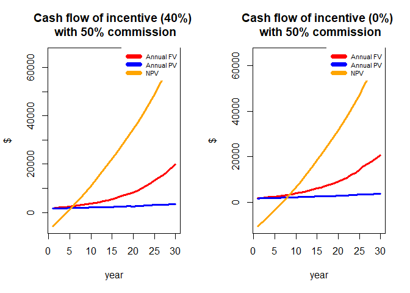<!-- -->


For case 3, the results are very similar. Hence, both case 2 and case 3 would require an incentive to cover around 80% to receive a comparable DPP as single-family household or condo owners receive.


```r
npv = c()
dpp = c()
com=0.2
for(j in 1:100){
rgs=gas_c
rei=u_cost
cf=-inst *6*0.5
q=data.frame(matrix(NA,30,6))
for(i in 1:30){
rgs = rgs*(1+runif(1,0.07,0.1)) #annual gas price increase
rei = rei*(1+runif(1,0.07,0.1)) #annual elec. price increase
fv=com*6*(rgs*gas - kw*rei)
pv= fv/(1+rt)^i
old=cf
cf=cf+pv
dp=ifelse(cf>0,i-1+abs(old/pv),0)
q[i,]=c(rgs,rei,fv,pv,cf,dp)
}
npv[j]=sum(q[,4])-inst #net present value
dpp[j]=min(q[,6][q[,6]>0]) #discounted payback period
}
par(mfrow= c(1,2))
plot(q[,3], main = "Cash flow of incentive (50%)", ylab="$", xlab="year",
type = 'l', ylim = c(min(q[,5]),max(q[,5])), col = 'red',lwd=3)
lines(q[,4], type = 'l', col='blue',lwd=3)
lines(q[,5], type = 'l', col='orange',lwd=3)
legend("topright", legend=c("Annual FV","Annual PV","NPV"),col=c("red","blue","orange"), lty=1, box.lty = 0, lwd=7,cex=0.7)


npv = c()
dpp = c()
com = 0.2
for(j in 1:100){
rgs=gas_c
rei=u_cost
cf=-inst * 6 * 0.2
q=data.frame(matrix(NA,30,6))
for(i in 1:30){
rgs = rgs*(1+runif(1,0.07,0.1)) #annual gas price increase
rei = rei*(1+runif(1,0.07,0.1)) #annual elec. price increase
fv=com*6*(rgs*gas - kw*rei)
pv= fv/(1+rt)^i
old=cf
cf=cf+pv
dp=ifelse(cf>0,i-1+abs(old/pv),0)
q[i,]=c(rgs,rei,fv,pv,cf,dp)
}
npv[j]=sum(q[,4])-inst #net present value
dpp[j]=min(q[,6][q[,6]>0]) #discounted payback period
}
plot(q[,3], main = "Cash flow of incentive (80%)", ylab="$", xlab="year",
type = 'l', ylim = c(min(q[,5]),max(q[,5])), col = 'red',lwd=3)
lines(q[,4], type = 'l', col='blue',lwd=3)
lines(q[,5], type = 'l', col='orange',lwd=3)
legend("topright", legend=c("Annual FV","Annual PV","NPV"),col=c("red","blue","orange"), lty=1, box.lty = 0, lwd=7,cex=0.7)
```

<!-- -->


To achieve the DPP of 5 years like the case 1, 1 owner single family, commission rate and incentive rate were estimated for each scenario: case 3, rental apartment (no owner living) and case 4, rental apartment (sharing chargers in addition to the case 3 above - 12 renters are sharing 6 installed chargers).

## Incentive comparison (case 3)

For the case 3, rental apartment, with the commission rate, 50%, it is estimated that about 40% incentive is required to meet the 5 year's DPP. It also shows there is not much improvement of shortening the DPP even if there is no incentive (in this case, the DPP is 8 years). We can see incentive supports a little from the investment perspectives. 


```r
par(mfrow = c(1,2))

npv = c()
dpp = c()
com = 0.5
for(j in 1:100){
  rgs=gas_c
  rei=u_cost
  cf=-inst *6*0.6
  q=data.frame(matrix(NA,30,6))
  for(i in 1:30){
    rgs = rgs*(1+runif(1,0.07,0.1)) #annual gas price increase
    rei = rei*(1+runif(1,0.07,0.1)) #annual elec. price increase
    fv=com*6*(rgs*gas - kw*rei)
    pv= fv/(1+rt)^i
    old=cf
    cf=cf+pv
    dp=ifelse(cf>0,i-1+abs(old/pv),0)
    q[i,]=c(rgs,rei,fv,pv,cf,dp)
  }
  npv[j]=sum(q[,4])-inst #net present value
  dpp[j]=min(q[,6][q[,6]>0]) #discounted payback period
}

plot(q[,3], main = "Cash flow of incentive (40%) \n with 50% commission", ylab="$", xlab="year",
     type = 'l', ylim = c(min(q[,5]),max(q[,5])), col = 'red',lwd=3)
lines(q[,4], type = 'l', col='blue',lwd=3)
lines(q[,5], type = 'l', col='orange',lwd=3)
legend("topright", legend=c("Annual FV","Annual PV","NPV"),col=c("red","blue","orange"), lty=1, box.lty = 0, lwd=7,cex=0.7)


npv = c()
dpp = c()
com = 0.5
for(j in 1:100){
  rgs=gas_c
  rei=u_cost
  cf=-inst * 6
  q=data.frame(matrix(NA,30,6))
  for(i in 1:30){
    rgs = rgs*(1+runif(1,0.07,0.1)) #annual gas price increase
    rei = rei*(1+runif(1,0.07,0.1)) #annual elec. price increase
    fv=com*6*(rgs*gas - kw*rei)
    pv= fv/(1+rt)^i
    old=cf
    cf=cf+pv
    dp=ifelse(cf>0,i-1+abs(old/pv),0)
    q[i,]=c(rgs,rei,fv,pv,cf,dp)
  }
  npv[j]=sum(q[,4])-inst #net present value
  dpp[j]=min(q[,6][q[,6]>0]) #discounted payback period
}
plot(q[,3], main = "Cash flow of incentive (0%) \n with 50% commission", ylab="$", xlab="year",
     type = 'l', ylim = c(min(q[,5]),max(q[,5])), col = 'red',lwd=3)
lines(q[,4], type = 'l', col='blue',lwd=3)
lines(q[,5], type = 'l', col='orange',lwd=3)
legend("topright", legend=c("Annual FV","Annual PV","NPV"),col=c("red","blue","orange"), lty=1, box.lty = 0, lwd=7,cex=0.7)
```

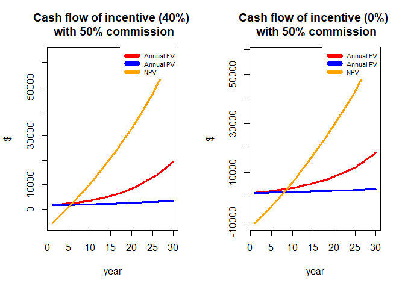<!-- -->

## Commission comparison (case 4)

In case 4, rental apartment with the sharing chargers, a scenario of 50% commission rate and no incentive is estimated to have the same DPP of 5 years of the scenario of 20% commission rate and 60% incentive rate, which confirms that the impact of commission rate change is more than the incentive rate change on DPP. Policy makers can take this account to support investment of chargers.  


```r
npv = c()
dpp = c()
com = 0.2
for(j in 1:100){
  rgs=gas_c
  rei=u_cost
  cf=-inst *6*0.4
  q=data.frame(matrix(NA,30,6))
  for(i in 1:30){
    rgs = rgs*(1+runif(1,0.07,0.1)) #annual gas price increase
    rei = rei*(1+runif(1,0.07,0.1)) #annual elec. price increase
    fv=com*12*(rgs*gas - kw*rei)
    pv= fv/(1+rt)^i
    old=cf
    cf=cf+pv
    dp=ifelse(cf>0,i-1+abs(old/pv),0)
    q[i,]=c(rgs,rei,fv,pv,cf,dp)
  }
  npv[j]=sum(q[,4])-inst #net present value
  dpp[j]=min(q[,6][q[,6]>0]) #discounted payback period
}
par(mfrow= c(1,2))
plot(q[,3], main = "Cash flow of incentive (60%) \n with 20% commission", ylab="$", xlab="year",
     type = 'l', ylim = c(min(q[,5]),max(q[,5])), col = 'red',lwd=3)
lines(q[,4], type = 'l', col='blue',lwd=3)
lines(q[,5], type = 'l', col='orange',lwd=3)
legend("topright", legend=c("Annual FV","Annual PV","NPV"),col=c("red","blue","orange"), lty=1, box.lty = 0, lwd=7,cex=0.7)


npv = c()
dpp = c()
com = 0.5
for(j in 1:100){
  rgs=gas_c
  rei=u_cost
  cf=-inst * 6
  q=data.frame(matrix(NA,30,6))
  for(i in 1:30){
    rgs = rgs*(1+runif(1,0.07,0.1)) #annual gas price increase
    rei = rei*(1+runif(1,0.07,0.1)) #annual elec. price increase
    fv=com*12*(rgs*gas - kw*rei)
    pv= fv/(1+rt)^i
    old=cf
    cf=cf+pv
    dp=ifelse(cf>0,i-1+abs(old/pv),0)
    q[i,]=c(rgs,rei,fv,pv,cf,dp)
  }
  npv[j]=sum(q[,4])-inst #net present value
  dpp[j]=min(q[,6][q[,6]>0]) #discounted payback period
}
plot(q[,3], main = "Cash flow of incentive (0%) \n with 50% commission", ylab="$", xlab="year",
     type = 'l', ylim = c(min(q[,5]),max(q[,5])), col = 'red',lwd=3)
lines(q[,4], type = 'l', col='blue',lwd=3)
lines(q[,5], type = 'l', col='orange',lwd=3)
legend("topright", legend=c("Annual FV","Annual PV","NPV"),col=c("red","blue","orange"), lty=1, box.lty = 0, lwd=7,cex=0.7)
```

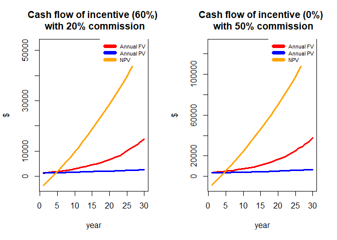<!-- -->


Adding a 60% incentive of upfront cost to case 4, shows a DPP of 5 years, which can also be achieved through changing the commission fee to 50%. It also confirms that commissions are more effective to reach the goal of a shorter DPP than incentivizing the upfront cost.

Furthermore, it was found that sharing chargers by two, is as effective as collecting commissions. By increasing the number of users for a given charger we can enhance the mechanism for owners to reach shorter DPP. By optimizing the utilization rate of chargers depending upon the local conditions, it can reduce the commissioning rate while getting the same result and thus deliver added value to both the renter and the landlord.


# Policy optimization

We start our policy effect analysis based on a case that assumes the installation of stand-alone level 2 chargers (\$2,050 installation cost) with a budget limited to 100 chargers (i.e. $205,000), For the eleven MUD block groups that were defined in the cluster analysis for Tacoma we find three of them related to the higher income cluster (1) while cluster 2 is more related to the characteristics of the remaining 8 block groups. To keep this analysis within simple bounds, we only consider the ownership structure cases 1 and 2 from the cost benefit analysis. 

Based on the identified renter and owner distribution structure of the MUD block clusters 1 and 2, the cluster 1 (i.e. 3 block groups) are assumed to include 30% of MUDs with the case 1 structure and 70% of the case 2 structure; cluster 2 (8 block groups) is assumed to have 10% of the case 1 structure and 90% of the case 2 structure.

The aim of the following analysis is to check how different social or rent household structures in MUDs affect the outcome of the selected policy application in terms of efficiency and equity. We considered a cash flow time horizon of 20 years to receive an average expected NPV per unit charger. Furthermore, based on the population of each block group, each of them was weighted in proportion to its population assuming that the EVSE demand is proportional to the population. 

These benefit weights were added to the objective functions of the maximization problem. The policy parameter α was set to different values depending on the policy goals. The efficiency-oriented policy seeks to maximize the benefit by focusing more on efficiency. By concentrating on cA_1, cA_2 and cA_3, which happen to be all cluster 1, the maximized benefit in terms of saved energy turns out to be $446,695 for a 20-year time horizon. This is the maximum benefit from installing 100 chargers. Thus, focusing on these block groups would maximize the efficiency. 

On the other hand, the equity policy seeks to maximize the benefit while focusing more on equity. The optimal solution was found and the expected benefit in terms of saved energy is estimated to $78,191 over a 20-year time horizon. This benefit is far lower than for the efficiency policy while it improves the equal resource allocation for all MUD block groups regardless of which cluster they are belong to. 


```r
library(nloptr)
c = 2050 #cost for one charger
m = 100*c #capacity
n = 11 #number of places for demand
npv = c(11741.5,1601) # (-5000,1500) #single,
c1 = c(0.3,0.7)
c2 = c(0.1,0.9)
cc1= t(c1)%*%npv
cc2= t(c2)%*%npv
b = c(rep(cc1,3),rep(cc2,8)) #benefit per cluster
pop=c(0.049,0.095,0.112,0.099,0.067,0.128,0.062,0.076,0.053,0.154,0.105) #population weight
bp=pop*b #total benefit

names(pop) = c("cA_1","cA_2","cA_3","cB_1","cB_2","cB_3","cB_4","cB_5","cB_6","cB_7","cB_8")
barplot(pop, col = "orange", main = "Population proportion in MUD blocks", 
        xlab="MUDs", ylab="Relative portion of population",cex.names = 0.7)
```

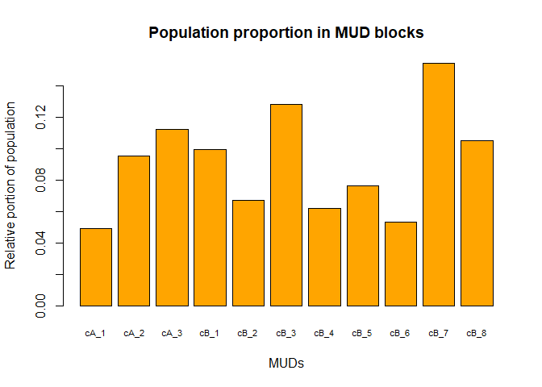<!-- -->

```r
# Objective function EQUITY
alpha = 1 # fair
eval.f <- function(x) {return(-sum(b*log(x)))} #max

# Constraint function
# to be of the form g(x) <= 0
eval.g <- function(x) {
  return(sum(c*x) - m)
}

x0 <- rep(9,11)

opts <- list('algorithm' = 'NLOPT_GN_ISRES', 'xtol_rel' = 1.0e-8, 'maxeval' = 100000)

eq = nloptr(
  x0 = x0,
  eval_f = eval.f,
  lb = rep(0,11),
  ub = rep(100,11),
  eval_g_eq = eval.g,
  opts = opts
)

par(mfrow=c(1,2))
bar1 = eq$solution
names(bar1) = c("cA_1","cA_2","cA_3","cB_1","cB_2","cB_3","cB_4","cB_5","cB_6","cB_7","cB_8")
barplot(bar1, col = "blue", main = "Equity oriented policy", 
        xlab="MUDs", ylim = c(0,80),ylab="number of chargers",cex.names = 0.7)


# Objective function Efficiency
alpha = 0 
eval.f <- function(x) {return (-sum(b*x^(1-alpha)/(1-alpha)))} #max


# Constraint function
# to be of the form g(x) <= 0
eval.g <- function(x) {
  return(sum(c*x) - m)
}

x0 <- rep(9,11)

opts <- list('algorithm' = 'NLOPT_GN_ISRES', 'xtol_rel' = 1.0e-8, 'maxeval' = 100000)

ef = nloptr(
  x0 = x0,
  eval_f = eval.f,
  lb = rep(0,11),
  ub = rep(100,11),
  eval_g_eq = eval.g,
  opts = opts
)

bar = ef$solution
names(bar) = c("cA_1","cA_2","cA_3","cB_1","cB_2","cB_3","cB_4","cB_5","cB_6","cB_7","cB_8")
barplot(bar, col = "red", main = "Efficiency oriented policy", 
        xlab="MUDs", ylim = c(0,80), ylab="number of chargers",cex.names = 0.7)
```

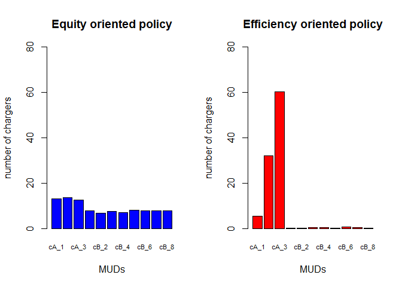<!-- -->


