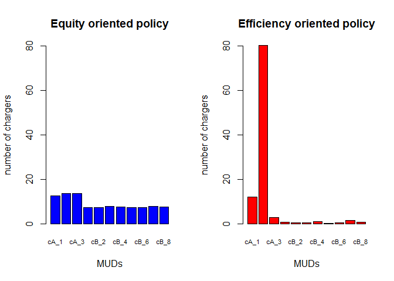

# Cost-benefit analysis of charger

It is necessary to analyze how much would it benefit from installation of one charger. The benefit could be estimated by the fuel cost reduction as EV uses electricity. Assumping electricity price and gas price keep changing annually and annual discount factor is 6%, the cost - benefit analyses were constructed based on 4 cases. 1) onwer takes the installation cost of 1 charger and uses it, 2) owner takes the installation cost for the whole chargers (5 renters) and uses one of them, 3) owner doesn't live in the building, but pays the cost of all chargers (6 chargers) and get commission of 20% of the benefit generated from the chargers, and 4) with the case 3, there are additional 6 more EVs are using by sharing the 6 installed chargers. Net present value (NPV) and discounted payback period (DPP) are measured for each scenario. 

## Benefits

### Conventional vehicle
* VMT 10,230 miles
* MPG 33 miles/ gallon
* Gas required 310 gallons
* Gas unit price $2.49/ gallon
* Total cost $772

### EV
* Fuel economy 30 kWh/100 mile
* Elec. need per year 3069 kWh
* Elec. unit cost $0.077/ kWh
* Elec. cost $236.3

**Annual benefit for one car $535.7**
 
### Cost 
* Installation $2,050 (based on Megan's table)

After 100 times Monte Carlo simulations, it shows that case 1 takes less than 6 years to reach the break-even point, while case 2, over 20 years and case 3, about 18 years. This analysis indicates that government supports are necessary to benefit buiding owners for the same impact as the single family households. 

Moreover, MUD charger has potential as one charger could serve muliple EVs. The case 4 shows that it only takes about 10 years to reach the break-even point. Government support could be lessen compared to the case 3. 


## case1, single owner - single user

<!-- --><!-- -->

```
##    Gas price($/gallon) Elec.price($/kWh)     FV($)    PV($)     NPV($)
## 1             2.708475        0.08445989  580.4199 547.5659 -1502.4341
## 2             2.909884        0.09148042  621.3105 552.9642  -949.4699
## 3             3.137913        0.09928487  668.0478 560.9058  -388.5641
## 4             3.361393        0.10743832  712.3035 564.2111   175.6470
## 5             3.675844        0.11804266  777.2388 580.7980   756.4450
## 6             4.018359        0.12640572  857.7522 604.6814  1361.1265
## 7             4.360408        0.13726639  930.4560 618.8064  1979.9328
## 8             4.668120        0.15093742  983.8903 617.3049  2597.2377
## 9             5.028860        0.16214218 1061.3322 628.2009  3225.4387
## 10            5.525489        0.17464856 1176.9051 657.1776  3882.6163
## 11            5.926670        0.18776830 1261.0066 664.2826  4546.8989
## 12            6.366832        0.20105194 1356.6896 674.2331  5221.1320
## 13            6.877447        0.21689345 1466.3627 687.4880  5908.6201
## 14            7.421266        0.23418809 1581.8691 699.6622  6608.2823
## 15            8.032412        0.25323741 1712.8621 714.7175  7322.9998
## 16            8.657347        0.27653346 1835.0964 722.3789  8045.3787
## 17            9.502452        0.29999737 2025.0682 752.0383  8797.4169
## 18           10.340363        0.32430572 2210.2183 774.3363  9571.7532
## 19           11.298147        0.35448599 2414.5082 798.0264 10369.7796
## 20           12.158407        0.38014063 2602.4545 811.4576 11181.2372
## 21           13.135703        0.41165772 2808.6904 826.1915 12007.4287
## 22           14.415903        0.44829474 3093.1132 858.3547 12865.7833
## 23           15.548110        0.48661542 3326.4915 870.8664 13736.6497
## 24           17.045592        0.53280794 3648.9459 901.2114 14637.8611
## 25           18.300585        0.58557931 3876.0385 903.1117 15540.9727
##    DPP(year)
## 1   0.000000
## 2   0.000000
## 3   0.000000
## 4   3.688686
## 5   4.302424
## 6   6.250981
## 7   8.199600
## 8  10.207382
## 9  12.134406
## 10 13.908016
## 11 15.844827
## 12 17.743808
## 13 19.594506
## 14 21.444961
## 15 23.246006
## 16 25.137339
## 17 26.698097
## 18 28.361236
## 19 29.994282
## 20 31.779200
## 21 33.533470
## 22 34.988889
## 23 36.773545
## 24 38.242429
## 25 40.208252
```

```
## [1] 16383.52
```

```
## [1] 3.608133
```

<!-- --><!-- -->


## case2, one owner - 5 renters 

<!-- --><!-- -->

```
##    Gas price($/gallon) Elec.price($/kWh)     FV($)     PV($)      NPV($)
## 1             2.690860        0.08358676  577.6388  544.9423 -11755.0577
## 2             2.933165        0.09098236  630.0562  560.7478 -11194.3100
## 3             3.146423        0.09941108  670.2984  562.7955 -10631.5145
## 4             3.429620        0.10838522  730.5480  578.6625 -10052.8520
## 5             3.750546        0.11906650  797.2540  595.7546  -9457.0974
## 6             4.042177        0.12958362  855.3827  603.0111  -8854.0864
## 7             4.410188        0.14026728  936.6781  622.9444  -8231.1419
## 8             4.726903        0.15306078  995.5963  624.6495  -7606.4925
## 9             5.179002        0.16551137 1097.5361  649.6299  -6956.8625
## 10            5.640512        0.18120986 1192.4256  665.8442  -6291.0183
## 11            6.199731        0.19502648 1323.3803  697.1403  -5593.8781
## 12            6.703996        0.21015246 1433.2809  712.2967  -4881.5814
## 13            7.258746        0.22960772 1545.5451  724.6118  -4156.9695
## 14            7.936762        0.24778198 1699.9532  751.8909  -3405.0786
## 15            8.637946        0.27171823 1843.8601  769.3784  -2635.7002
## 16            9.297676        0.29852521 1966.1056  773.9502  -1861.7500
## 17           10.100916        0.32212044 2142.6963  795.7212  -1066.0288
## 18           10.902062        0.35105917 2302.2386  806.5750   -259.4538
## 19           11.942827        0.38209799 2529.6176  836.0715    576.6177
## 20           12.906498        0.41907568 2714.8713  846.5097   1423.1274
## 21           13.997864        0.44979760 2958.9090  870.3791   2293.5064
## 22           15.249713        0.48879882 3227.2875  895.5887   3189.0952
## 23           16.638167        0.53385891 3519.4189  921.3742   4110.4694
## 24           17.971886        0.58380621 3779.5833  933.4760   5043.9454
## 25           19.272991        0.64190506 4004.6207  933.0711   5977.0165
## 26           20.921089        0.68935721 4369.9002  960.5479   6937.5644
## 27           22.981378        0.74936643 4824.4216 1000.4304   7937.9949
## 28           25.132878        0.81113717 5301.8121 1037.1943   8975.1891
## 29           26.981473        0.89053643 5631.2004 1039.2760  10014.4651
## 30           29.062625        0.95660861 6073.5819 1057.4721  11071.9372
##    DPP(year)
## 1    0.00000
## 2    0.00000
## 3    0.00000
## 4    0.00000
## 5    0.00000
## 6    0.00000
## 7    0.00000
## 8    0.00000
## 9    0.00000
## 10   0.00000
## 11   0.00000
## 12   0.00000
## 13   0.00000
## 14   0.00000
## 15   0.00000
## 16   0.00000
## 17   0.00000
## 18   0.00000
## 19  18.31032
## 20  19.68117
## 21  21.63507
## 22  23.56089
## 23  25.46124
## 24  27.40340
## 25  29.40575
## 26  31.22251
## 27  32.93458
## 28  34.65333
## 29  36.63600
## 30  38.47019
```

```
## [1] 21548.45
```

```
## [1] 18.20534
```

<!-- --><!-- -->


## case3, no onwer but only 6 renters living 

Here it is assumed that the owner doesn't live in the building while collecting a commission of 20% of profit generated from the charger installation. This commission could be interpreted as the increased rental or tax credits if government supports. 

<!-- --><!-- -->

```
##    Gas price($/gallon) Elec.price($/kWh)     FV($)     PV($)      NPV($)
## 1             2.712198        0.08391499  699.8957  660.2789 -11639.7211
## 2             2.946886        0.09198231  757.4892  674.1627 -10965.5584
## 3             3.224023        0.10066915  828.5921  695.7019 -10269.8565
## 4             3.516078        0.10812885  909.7642  720.6185  -9549.2380
## 5             3.832106        0.11845209  989.3081  739.2686  -8809.9695
## 6             4.110872        0.12908759 1053.8405  742.9160  -8067.0535
## 7             4.505887        0.13972766 1161.6008  772.5308  -7294.5227
## 8             4.913768        0.15111957 1271.3785  797.6786  -6496.8440
## 9             5.374112        0.16540895 1390.0017  822.7399  -5674.1042
## 10            5.818335        0.18177578 1494.9767  834.7872  -4839.3170
## 11            6.291663        0.19719690 1614.2620  850.3731  -3988.9439
## 12            6.908134        0.21127716 1791.7342  890.4370  -3098.5069
## 13            7.420741        0.23181324 1906.7940  893.9794  -2204.5275
## 14            8.142535        0.24883127 2112.6273  934.4171  -1270.1104
## 15            8.911006        0.26824674 2326.9952  970.9738   -299.1366
## 16            9.555120        0.29077730 2483.6301  977.6717    678.5351
## 17           10.373232        0.31581408 2695.7621 1001.1101   1679.6453
## 18           11.103728        0.34213673 2870.5658 1005.6849   2685.3302
## 19           12.021129        0.36703944 3120.1273 1031.2427   3716.5729
## 20           13.173321        0.40116157 3423.0775 1067.3318   4783.9046
## 21           14.304134        0.42958200 3739.0733 1099.8686   5883.7732
## 22           15.712199        0.47191550 4106.9678 1139.7045   7023.4777
## 23           16.993756        0.51613077 4420.8708 1157.3719   8180.8496
## 24           18.519308        0.56464114 4809.7223 1187.8982   9368.7478
## 25           19.830180        0.61070215 5127.7331 1194.7548  10563.5026
## 26           21.664928        0.66064662 5626.3240 1236.7224  11800.2251
## 27           23.809494        0.71449921 6225.7739 1291.0260  13091.2511
## 28           25.572506        0.76972239 6678.2388 1306.4648  14397.7159
## 29           27.515768        0.84531229 7122.7496 1314.5514  15712.2673
## 30           30.143166        0.90867065 7866.8053 1369.6905  17081.9578
##    DPP(year)
## 1    0.00000
## 2    0.00000
## 3    0.00000
## 4    0.00000
## 5    0.00000
## 6    0.00000
## 7    0.00000
## 8    0.00000
## 9    0.00000
## 10   0.00000
## 11   0.00000
## 12   0.00000
## 13   0.00000
## 14   0.00000
## 15   0.00000
## 16  15.30597
## 17  16.67778
## 18  18.67015
## 19  20.60398
## 20  22.48212
## 21  24.34952
## 22  26.16254
## 23  28.06847
## 24  29.88683
## 25  31.84157
## 26  33.54153
## 27  35.14019
## 28  37.02036
## 29  38.95257
## 30  40.47140
```

```
## [1] 26104.99
```

```
## [1] 15.70718
```

<!-- --><!-- -->

## case4, 12 renters (sharing chargers) but rest conditions are the same as case3. 

This case, 2 EV owners are using one charger by sharing it given the same utilization rate as the case3. 

<!-- --><!-- -->

```
##    Gas price($/gallon) Elec.price($/kWh)    FV($)    PV($)      NPV($)
## 1             2.678208        0.08423836 1372.120 1294.453 -11005.5468
## 2             2.937575        0.09060479 1518.197 1351.190  -9654.3567
## 3             3.182377        0.09865394 1641.043 1377.852  -8276.5052
## 4             3.431691        0.10616466 1771.212 1402.966  -6873.5395
## 5             3.673898        0.11462072 1889.130 1411.668  -5461.8719
## 6             4.036903        0.12354200 2093.495 1475.831  -3986.0407
## 7             4.351924        0.13459909 2246.429 1494.003  -2492.0374
## 8             4.724111        0.14560570 2442.265 1532.307   -959.7300
## 9             5.166927        0.15808762 2679.784 1586.160    626.4298
## 10            5.553787        0.17162517 2867.895 1601.418   2227.8474
## 11            6.065685        0.18533646 3147.755 1658.198   3886.0456
## 12            6.543655        0.20283697 3374.463 1677.005   5563.0506
## 13            7.156991        0.21977644 3706.016 1737.525   7300.5755
## 14            7.797833        0.23810113 4047.830 1790.359   9090.9345
## 15            8.406798        0.25511668 4375.570 1825.773  10916.7072
## 16            9.155518        0.27722444 4769.781 1877.606  12794.3137
## 17            9.817464        0.29802992 5109.024 1897.310  14691.6234
## 18           10.797653        0.32735541 5622.284 1969.732  16661.3559
## 19           11.761155        0.35903070 6105.823 2018.054  18679.4098
## 20           12.809625        0.38448408 6698.405 2088.594  20768.0042
##    DPP(year)
## 1   0.000000
## 2   0.000000
## 3   0.000000
## 4   0.000000
## 5   0.000000
## 6   0.000000
## 7   0.000000
## 8   0.000000
## 9   8.605065
## 10  9.391172
## 11 11.343535
## 12 13.317254
## 13 15.201710
## 14 17.077716
## 15 18.979226
## 16 20.814161
## 17 22.743397
## 18 24.458690
## 19 26.256150
## 20 27.943532
```

```
## [1] 31187.38
```

```
## [1] 8.540876
```

<!-- --><!-- -->


<!-- --><!-- -->

