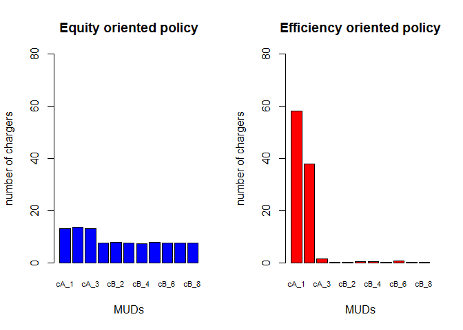

# Cost-benefit analysis of charger

It is necessary to analyze how much would it benefit from installation of one charger. The benefit could be estimated by the fuel cost reduction as EV uses electricity. Assumping electricity price and gas price keep changing annually and annual discount factor is 6%, the cost - benefit analyses were constructed based on 4 cases. 1) onwer takes the installation cost of 1 charger and uses it, 2) owner takes the installation cost for the whole chargers (5 renters) and uses one of them, 3) owner doesn't live in the building, but pays the cost of all chargers (6 chargers) and get commission of 20% of the benefit generated from the chargers, and 4) with the case 3, there are additional 6 more EVs are using by sharing the 6 installed chargers. Net present value (NPV) and discounted payback period (DPP) are measured for each scenario. 


To assess how rebates can be applied in the proposed policies, it needed to be analyzed how the expected benefits through the installation of a charger compare to their cost and calculate a break-even point. This analysis assumes EV-ready buildings and will be based on the outcome of the previous sections and the fuel cost reduction achieved by using EVs, plus the installation cost of the chargers. This break-even point heavily depends on the individual situation (condos, apartments, owner-renter relationships, etc.). Assuming annual changes of gasoline and energy prices and an annual discount factor of 6%, four different example cases were provided:

* Case 1: Condo - Owner invests into the installation of one charger for personal use
* Case 2: Mixed Condo / Rental apartments (condo owner owns 5 additional units in the building and rents them out to tenants) - Owner invests into multiple chargers and uses one of them
* Case 3: Rental apartments - Landlord invests into a set of chargers (in this case we assume 6 chargers), while not using any of them for personal use and receiving a commission of 20% of the benefits generated through the chargers
* Case 4: Rental apartments - Sharing chargers with case 3 above - 12 renters are sharing 6 installed chargers (2 renters share 1 charger)

These cases all assume that the installed chargers will be used such that the upfront cost for a charger (level 2 stands alone) is \$2,050 for charger ready sites. The net present value (NPV) and discounted payback period (DPP) were measured for each scenario. We assume the annual vehicle miles travelled to be 10,230 miles per vehicle and an average MPG of 33 according to the standard applied to the year 2017. Thus, an internal combustion engine (ICE) vehicle requires 310 gallons of fuel on average per year. The total cost was calculated to be \$772 per year based in a fuel price of \$2.49 / gallon. For EVs we assume the same mileage and a fuel economy of 30 kWh / 100 miles (34 kWh/ 100 miles for Tesla models S - 90D, 30 kWh/ 100 miles for Nissan Leaf, 32 kWh/ 100 miles for Kia Soul). Thus, the annual energy requirement is 3069 kWh. Based on a price of \$0.077/kWh the annual cost is calculated as \$236.30, which results in an annual benefit in operational cost of \$535.70 per EV. For case 1, we achieve break-even within less than 6 years, which is reasonable as the investor directly receives their Return-On-Investment (ROI). In each case, Net present value (NPV), present value (PV) and future value (FV) would be measured. This is a case comparable to single family housing EVSE.


## Benefits

### Conventional vehicle
* VMT 10,230 miles
* MPG 33 miles/ gallon
* Gas required 310 gallons
* Gas unit price $2.49/ gallon
* Total cost $772

### EV
* Fuel economy 30 kWh/100 mile
* Elec. need per year 3069 kWh
* Elec. unit cost $0.077/ kWh
* Elec. cost $236.3

**Annual benefit for one car $535.7**
 
### Cost 
* Installation $2,050 (based on Megan's table)

After 100 times Monte Carlo simulations, it shows that case 1 takes less than 6 years to reach the break-even point, while case 2, over 20 years and case 3, about 18 years. This analysis indicates that government supports are necessary to benefit buiding owners for the same impact as the single family households. 

Moreover, MUD charger has potential as one charger could serve muliple EVs. The case 4 shows that it only takes about 10 years to reach the break-even point. Government support could be lessen compared to the case 3. 


```r
vmt=10230
mpg=33
gas=vmt/mpg
gas_c=2.49
c_cost=gas_c*gas

kw=3069
u_cost=0.077
e_cost=kw*u_cost

ben=c_cost-e_cost

inst=2050

rt=0.06
```


## case1, single owner - single user


```r
npv = c()
dpp = c()

for(j in 1:100){
  rgs=gas_c
  rei=u_cost
  cf=-inst
  q=data.frame(matrix(NA,25,6))
  for(i in 1:25){
    rgs = rgs*(1+runif(1,0.07,0.1)) #annual gas price increase
    rei = rei*(1+runif(1,0.07,0.1)) #annual elec. price increase
    fv=rgs*gas - kw*rei
    pv= fv/(1+rt)^i
    old=cf
    cf=cf+pv
    dp=ifelse(cf>0,i-1+abs(old/pv),0)
    q[i,]=c(rgs,rei,fv,pv,cf,dp)
  }
  npv[j]=sum(q[,4])-inst #net present value
  dpp[j]=min(q[,6][q[,6]>0]) #discounted payback period
}
plot(npv)
```

<!-- -->

```r
plot(dpp)
```

<!-- -->

```r
colnames(q) = c("Gas price($/gallon)","Elec.price($/kWh)","FV($)","PV($)","NPV($)","DPP(year)")
q
```

```
##    Gas price($/gallon) Elec.price($/kWh)     FV($)    PV($)     NPV($)
## 1             2.727164        0.08352432  589.0846 555.7402 -1494.2598
## 2             2.946287        0.09041818  635.8555 565.9091  -928.3507
## 3             3.184472        0.09774736  687.1998 576.9862  -351.3645
## 4             3.430153        0.10468934  742.0558 587.7777   236.4132
## 5             3.762013        0.11292095  819.6697 612.5049   848.9181
## 6             4.077785        0.12320573  885.9949 624.5914  1473.5095
## 7             4.445790        0.13307316  969.7934 644.9680  2118.4775
## 8             4.807323        0.14558714 1043.4633 654.6818  2773.1593
## 9             5.248038        0.15948881 1137.4207 673.2376  3446.3968
## 10            5.711546        0.17448025 1235.0994 689.6731  4136.0699
## 11            6.150035        0.18831016 1328.5868 699.8830  4835.9529
## 12            6.744723        0.20463217 1462.8479 726.9906  5562.9434
## 13            7.393583        0.22166004 1611.7359 755.6447  6318.5881
## 14            7.981184        0.23894716 1740.8382 769.9744  7088.5625
## 15            8.739921        0.25953851 1912.8517 798.1662  7886.7287
## 16            9.414369        0.27833818 2064.2344 812.5782  8699.3069
## 17           10.235995        0.30079181 2250.0285 835.5805  9534.8875
## 18           11.100618        0.33062915 2426.4907 850.1060 10384.9934
## 19           11.968639        0.36004035 2605.3142 861.0902 11246.0836
## 20           12.827725        0.39083712 2777.1157 865.9178 12112.0015
## 21           13.817804        0.42183874 2988.8960 879.1999 12991.2014
## 22           15.157210        0.45528471 3301.4664 916.1737 13907.3751
## 23           16.278401        0.49551660 3525.5638 922.9830 14830.3581
## 24           17.687192        0.53295799 3847.3816 950.2207 15780.5788
## 25           18.954134        0.57510591 4110.7816 957.8065 16738.3853
##    DPP(year)
## 1   0.000000
## 2   0.000000
## 3   0.000000
## 4   3.597785
## 5   4.385978
## 6   6.359157
## 7   8.284624
## 8  10.235889
## 9  12.119139
## 10 13.997146
## 11 15.909659
## 12 17.652016
## 13 19.361851
## 14 21.206231
## 15 22.881061
## 16 24.705809
## 17 26.411094
## 18 28.216116
## 19 30.060285
## 20 31.987472
## 21 33.776163
## 22 35.179845
## 23 37.067857
## 24 38.607277
## 25 40.475749
```

```r
mean(npv)
```

```
## [1] 16359.65
```

```r
mean(dpp)
```

```
## [1] 3.617318
```

```r
par(mfrow= c(1,1))
plot(q[,3], main = "Cash flow", ylab="$", xlab="year",
     type = 'l', ylim = c(min(q[,5]),max(q[,5])), col = 'red',lwd=3,cex.main=0.9)
lines(q[,4], type = 'l', col='blue',lwd=3)
lines(q[,5], type = 'l', col='orange',lwd=3)
legend("bottomright", legend=c("Annual FV","Annual PV","NPV"),col=c("red","blue","orange"), lty=1, box.lty = 0, lwd=7,cex=0.9)
```

<!-- -->

```r
par(mfrow= c(1,2))
plot(q[,1], main = "Gas price", ylab="$/gallon", xlab="year",
     type = 'l', ylim = c(min(q[,1]),max(q[,1])), col = 'red',lwd=3,cex.main=0.9)

plot(q[,2], main = "Electricity price", ylab="$/kWh", xlab="year",
     type = 'l', ylim = c(min(q[,2]),max(q[,2])), col = 'red',lwd=3,cex.main=0.9)
```

<!-- -->


## case2, one owner - 5 renters 


```r
npv = c()
dpp = c()

for(j in 1:100){
  rgs=gas_c
  rei=u_cost
  cf=-inst * 6 
  q=data.frame(matrix(NA,30,6))
  for(i in 1:30){
    rgs = rgs*(1+runif(1,0.07,0.1)) #annual gas price increase
    rei = rei*(1+runif(1,0.07,0.1)) #annual elec. price increase
    fv=rgs*gas - kw*rei
    pv= fv/(1+rt)^i
    old=cf
    cf=cf+pv
    dp=ifelse(cf>0,i-1+abs(old/pv),0)
    q[i,]=c(rgs,rei,fv,pv,cf,dp)
  }
  npv[j]=sum(q[,4])-inst #net present value
  dpp[j]=min(q[,6][q[,6]>0]) #discounted payback period
}
plot(npv)
```

<!-- -->

```r
plot(dpp)
```

<!-- -->

```r
colnames(q) = c("Gas price($/gallon)","Elec.price($/kWh)","FV($)","PV($)","NPV($)","DPP(year)")
q
```

```
##    Gas price($/gallon) Elec.price($/kWh)     FV($)     PV($)       NPV($)
## 1             2.673080        0.08283212  574.4430  541.9273 -11758.07266
## 2             2.878069        0.08908196  618.8089  550.7377 -11207.33496
## 3             3.102304        0.09540812  668.9066  561.6269 -10645.70810
## 4             3.359906        0.10479140  719.9661  570.2806 -10075.42751
## 5             3.693291        0.11391479  795.3159  594.3063  -9481.12124
## 6             4.059514        0.12303072  880.8680  620.9772  -8860.14407
## 7             4.346806        0.13433106  935.2479  621.9933  -8238.15077
## 8             4.744481        0.14655383 1021.0153  640.5976  -7597.55315
## 9             5.160121        0.16093214 1105.7368  654.4839  -6943.06923
## 10            5.636118        0.17367668 1214.1829  677.9934  -6265.07585
## 11            6.141517        0.19012944 1320.3630  695.5507  -5569.52511
## 12            6.716151        0.20471896 1453.7242  722.4564  -4847.06872
## 13            7.370496        0.22448091 1595.9219  748.2304  -4098.83828
## 14            7.950249        0.24548546 1711.1822  756.8575  -3341.98073
## 15            8.731959        0.26852092 1882.8167  785.6336  -2556.34708
## 16            9.478170        0.29401233 2035.9088  801.4279  -1754.91915
## 17           10.231295        0.31722019 2198.1526  816.3157   -938.60348
## 18           11.140537        0.34334649 2399.8360  840.7676    -97.83586
## 19           12.080856        0.36945361 2611.2122  863.0396    765.20374
## 20           13.210653        0.40068583 2865.5976  893.5069   1658.71060
## 21           14.196293        0.43796756 3056.7283  899.1532   2557.86375
## 22           15.548310        0.47856367 3351.2641  929.9929   3487.85661
## 23           16.755620        0.51920620 3600.7985  942.6792   4430.53579
## 24           18.030838        0.56418562 3858.0741  952.8615   5383.39733
## 25           19.480467        0.60885131 4170.3801  971.6929   6355.09018
## 26           21.201048        0.65194356 4571.5102 1004.8638   7359.95396
## 27           22.786003        0.70672319 4894.7275 1015.0096   8374.96357
## 28           24.687310        0.77171588 5284.6700 1033.8407   9408.80431
## 29           27.015416        0.82920540 5829.9477 1075.9561  10484.76044
## 30           29.265370        0.90465725 6295.8715 1096.1750  11580.93544
##    DPP(year)
## 1    0.00000
## 2    0.00000
## 3    0.00000
## 4    0.00000
## 5    0.00000
## 6    0.00000
## 7    0.00000
## 8    0.00000
## 9    0.00000
## 10   0.00000
## 11   0.00000
## 12   0.00000
## 13   0.00000
## 14   0.00000
## 15   0.00000
## 16   0.00000
## 17   0.00000
## 18   0.00000
## 19  18.11336
## 20  19.85640
## 21  21.84475
## 22  23.75041
## 23  25.69994
## 24  27.64972
## 25  29.54023
## 26  31.32433
## 27  33.25112
## 28  35.10083
## 29  36.74460
## 30  38.56486
```

```r
mean(npv)
```

```
## [1] 21528.54
```

```r
mean(dpp)
```

```
## [1] 18.24586
```

```r
par(mfrow= c(1,1))
plot(q[,3], main = "Cash flow", ylab="$", xlab="year",
     type = 'l', ylim = c(min(q[,5]),max(q[,5])), col = 'red',lwd=3,cex.main=0.9)
lines(q[,4], type = 'l', col='blue',lwd=3)
lines(q[,5], type = 'l', col='orange',lwd=3)
legend("bottomright", legend=c("Annual FV","Annual PV","NPV"),col=c("red","blue","orange"), lty=1, box.lty = 0, lwd=7,cex=0.9)
```

<!-- -->

```r
par(mfrow= c(1,2))
plot(q[,1], main = "Gas price", ylab="$/gallon", xlab="year",
     type = 'l', ylim = c(min(q[,1]),max(q[,1])), col = 'red',lwd=3,cex.main=0.9)

plot(q[,2], main = "Electricity price", ylab="$/kWh", xlab="year",
     type = 'l', ylim = c(min(q[,2]),max(q[,2])), col = 'red',lwd=3,cex.main=0.9)
```

<!-- -->


## case3, no onwer but only 6 renters living 

Here it is assumed that the owner doesn't live in the building while collecting a commission of 20% of profit generated from the charger installation. This commission could be interpreted as the increased rental or tax credits if government supports. 


```r
npv = c()
dpp = c()
com = 0.2

for(j in 1:100){
  rgs=gas_c
  rei=u_cost
  cf=-inst * 6
  q=data.frame(matrix(NA,30,6))
  for(i in 1:30){
    rgs = rgs*(1+runif(1,0.07,0.1)) #annual gas price increase
    rei = rei*(1+runif(1,0.07,0.1)) #annual elec. price increase
    fv=com*6*(rgs*gas - kw*rei)
    pv= fv/(1+rt)^i
    old=cf
    cf=cf+pv
    dp=ifelse(cf>0,i-1+abs(old/pv),0)
    q[i,]=c(rgs,rei,fv,pv,cf,dp)
  }
  npv[j]=sum(q[,4])-inst #net present value
  dpp[j]=min(q[,6][q[,6]>0]) #discounted payback period
}
plot(npv)
```

<!-- -->

```r
plot(dpp)
```

<!-- -->

```r
colnames(q) = c("Gas price($/gallon)","Elec.price($/kWh)","FV($)","PV($)","NPV($)","DPP(year)")
q
```

```
##    Gas price($/gallon) Elec.price($/kWh)     FV($)     PV($)      NPV($)
## 1             2.720673        0.08247666  708.3452  668.2502 -11631.7498
## 2             2.931631        0.09018967  758.4164  674.9879 -10956.7619
## 3             3.208628        0.09869319  830.1423  697.0035 -10259.7585
## 4             3.466939        0.10844949  890.3036  705.2038  -9554.5547
## 5             3.737492        0.11813357  955.2848  713.8444  -8840.7103
## 6             4.089283        0.12895579 1046.2948  737.5965  -8103.1138
## 7             4.401446        0.14121834 1117.2589  743.0410  -7360.0728
## 8             4.829753        0.15431807 1228.3457  770.6793  -6589.3935
## 9             5.217470        0.16728808 1324.8102  784.1531  -5805.2404
## 10            5.724121        0.18348923 1453.6189  811.6932  -4993.5472
## 11            6.157959        0.20167077 1548.0475  815.4921  -4178.0550
## 12            6.740221        0.21750442 1706.3370  847.9972  -3330.0578
## 13            7.319049        0.23625101 1852.6209  868.5810  -2461.4769
## 14            7.876846        0.25729564 1982.6183  876.9140  -1584.5629
## 15            8.582956        0.28239884 2152.8410  898.3053   -686.2576
## 16            9.335488        0.31035587 2329.8229  917.1261    230.8685
## 17           10.103390        0.33995919 2506.4592  930.8098   1161.6783
## 18           10.979399        0.36985649 2722.2289  953.7160   2115.3943
## 19           12.049488        0.40510609 2990.4848  988.3941   3103.7884
## 20           13.182436        0.43922275 3286.2967 1024.6829   4128.4713
## 21           14.384821        0.47769680 3591.8916 1056.5743   5185.0456
## 22           15.697965        0.51674455 3936.5762 1092.4200   6277.4656
## 23           17.115926        0.56035563 4303.4467 1126.6306   7404.0961
## 24           18.428082        0.60958326 4610.2735 1138.6386   8542.7348
## 25           19.718310        0.66255251 4895.1631 1140.5663   9683.3011
## 26           21.423983        0.72686747 5292.8143 1163.4137  10846.7147
## 27           23.552234        0.78498384 5870.4926 1217.3520  12064.0667
## 28           25.407144        0.86172665 6277.8906 1228.1446  13292.2114
## 29           27.307957        0.94196583 6689.4881 1234.5901  14526.8015
## 30           29.352682        1.01432785 7183.6310 1250.7429  15777.5444
##    DPP(year)
## 1    0.00000
## 2    0.00000
## 3    0.00000
## 4    0.00000
## 5    0.00000
## 6    0.00000
## 7    0.00000
## 8    0.00000
## 9    0.00000
## 10   0.00000
## 11   0.00000
## 12   0.00000
## 13   0.00000
## 14   0.00000
## 15   0.00000
## 16  15.74827
## 17  16.24803
## 18  18.21805
## 19  20.14023
## 20  22.02902
## 21  23.90741
## 22  25.74638
## 23  27.57189
## 24  29.50259
## 25  31.48991
## 26  33.32318
## 27  34.91009
## 28  36.82300
## 29  38.76650
## 30  40.61454
```

```r
mean(npv)
```

```
## [1] 26205.21
```

```r
mean(dpp)
```

```
## [1] 15.65944
```

```r
par(mfrow= c(1,1))
plot(q[,3], main = "Cash flow", ylab="$", xlab="year",
     type = 'l', ylim = c(min(q[,5]),max(q[,5])), col = 'red',lwd=3,cex.main=0.9)
lines(q[,4], type = 'l', col='blue',lwd=3)
lines(q[,5], type = 'l', col='orange',lwd=3)
legend("bottomright", legend=c("Annual FV","Annual PV","NPV"),col=c("red","blue","orange"), lty=1, box.lty = 0, lwd=7,cex=0.9)
```

<!-- -->

```r
par(mfrow= c(1,2))
plot(q[,1], main = "Gas price", ylab="$/gallon", xlab="year",
     type = 'l', ylim = c(min(q[,1]),max(q[,1])), col = 'red',lwd=3,cex.main=0.9)

plot(q[,2], main = "Electricity price", ylab="$/kWh", xlab="year",
     type = 'l', ylim = c(min(q[,2]),max(q[,2])), col = 'red',lwd=3,cex.main=0.9)
```

<!-- -->

## case4, 12 renters (sharing chargers) but rest conditions are the same as case3. 

This case, 2 EV owners are using one charger by sharing it given the same utilization rate as the case3. 


```r
npv = c()
dpp = c()
com = 0.2

for(j in 1:100){
  rgs=gas_c
  rei=u_cost
  cf=-inst * 6
  q=data.frame(matrix(NA,20,6))
  for(i in 1:20){
    rgs = rgs*(1+runif(1,0.07,0.1)) #annual gas price increase
    rei = rei*(1+runif(1,0.07,0.1)) #annual elec. price increase
    fv=com*12*(rgs*gas - kw*rei)
    pv= fv/(1+rt)^i
    old=cf
    cf=cf+pv
    dp=ifelse(cf>0,i-1+abs(old/pv),0)
    q[i,]=c(rgs,rei,fv,pv,cf,dp)
  }
  npv[j]=sum(q[,4])-inst #net present value
  dpp[j]=min(q[,6][q[,6]>0]) #discounted payback period
}
plot(npv)
```

<!-- -->

```r
plot(dpp)
```

<!-- -->

```r
colnames(q) = c("Gas price($/gallon)","Elec.price($/kWh)","FV($)","PV($)","NPV($)","DPP(year)")
q
```

```
##    Gas price($/gallon) Elec.price($/kWh)    FV($)    PV($)      NPV($)
## 1             2.675807        0.08267896 1381.820 1303.604 -10996.3963
## 2             2.878915        0.08942964 1483.210 1320.052  -9676.3445
## 3             3.108822        0.09828414 1589.042 1334.190  -8342.1541
## 4             3.341620        0.10681191 1699.432 1346.109  -6996.0450
## 5             3.627976        0.11582240 1846.112 1379.523  -5616.5224
## 6             3.955276        0.12633421 2012.198 1418.520  -4198.0023
## 7             4.247349        0.13687315 2151.874 1431.119  -2766.8829
## 8             4.552771        0.14791372 2297.788 1441.661  -1325.2222
## 9             4.976895        0.15905148 2531.301 1498.273    173.0507
## 10            5.336253        0.17182656 2704.567 1510.216   1683.2666
## 11            5.856590        0.18644487 2984.024 1571.947   3255.2133
## 12            6.282773        0.20395474 3172.134 1576.454   4831.6669
## 13            6.896274        0.22362141 3483.722 1633.305   6464.9716
## 14            7.436682        0.24321182 3741.490 1654.865   8119.8363
## 15            7.999529        0.26154887 4025.185 1679.569   9799.4054
## 16            8.756095        0.28307570 4429.512 1743.661  11543.0664
## 17            9.574788        0.30523889 4875.375 1810.541  13353.6072
## 18           10.429342        0.33413458 5298.329 1856.237  15209.8438
## 19           11.438461        0.36700424 5807.009 1919.292  17129.1357
## 20           12.418494        0.40147468 6282.258 1958.838  19087.9735
##    DPP(year)
## 1   0.000000
## 2   0.000000
## 3   0.000000
## 4   0.000000
## 5   0.000000
## 6   0.000000
## 7   0.000000
## 8   0.000000
## 9   8.884500
## 10  9.114587
## 11 11.070817
## 12 13.064896
## 13 14.958215
## 14 16.906647
## 15 18.834476
## 16 20.620017
## 17 22.375480
## 18 24.193914
## 19 25.924716
## 20 27.744540
```

```r
mean(npv)
```

```
## [1] 30991.81
```

```r
mean(dpp)
```

```
## [1] 8.564768
```

```r
par(mfrow= c(1,1))
plot(q[,3], main = "Cash flow", ylab="$", xlab="year",
     type = 'l', ylim = c(min(q[,5]),max(q[,5])), col = 'red',lwd=3,cex.main=0.9)
lines(q[,4], type = 'l', col='blue',lwd=3)
lines(q[,5], type = 'l', col='orange',lwd=3)
legend("bottomright", legend=c("Annual FV","Annual PV","NPV"),col=c("red","blue","orange"), lty=1, box.lty = 0, lwd=7,cex=0.9)
```

<!-- -->

```r
par(mfrow= c(1,2))
plot(q[,1], main = "Gas price", ylab="$/gallon", xlab="year",
     type = 'l', ylim = c(min(q[,1]),max(q[,1])), col = 'red',lwd=3,cex.main=0.9)

plot(q[,2], main = "Electricity price", ylab="$/kWh", xlab="year",
     type = 'l', ylim = c(min(q[,2]),max(q[,2])), col = 'red',lwd=3,cex.main=0.9)
```

<!-- -->


# Commission vs. Incentive 

To achieve the DPP of 5 years like the case 1, 1 owner single family, commission rate and incentive rate were estimated for each scenario: case 3, rental apartment (no owner living) and case 4, rental apartment (sharing chargers in addition to the case 3 above - 12 renters are sharing 6 installed chargers).

## Incentive comparison (case 3)

For the case 3, rental apartment, with the commission rate, 50%, it is estimated that about 40% incentive is required to meet the 5 year's DPP. It also shows there is not much improvement of shortening the DPP even if there is no incentive (in this case, the DPP is 8 years). We can see incentive supports a little from the investment perspectives. 


```r
par(mfrow = c(1,2))

npv = c()
dpp = c()
com = 0.5
for(j in 1:100){
  rgs=gas_c
  rei=u_cost
  cf=-inst *6*0.6
  q=data.frame(matrix(NA,30,6))
  for(i in 1:30){
    rgs = rgs*(1+runif(1,0.07,0.1)) #annual gas price increase
    rei = rei*(1+runif(1,0.07,0.1)) #annual elec. price increase
    fv=com*6*(rgs*gas - kw*rei)
    pv= fv/(1+rt)^i
    old=cf
    cf=cf+pv
    dp=ifelse(cf>0,i-1+abs(old/pv),0)
    q[i,]=c(rgs,rei,fv,pv,cf,dp)
  }
  npv[j]=sum(q[,4])-inst #net present value
  dpp[j]=min(q[,6][q[,6]>0]) #discounted payback period
}

plot(q[,3], main = "Cash flow of incentive (40%) \n with 50% commission", ylab="$", xlab="year",
     type = 'l', ylim = c(min(q[,5]),max(q[,5])), col = 'red',lwd=3)
lines(q[,4], type = 'l', col='blue',lwd=3)
lines(q[,5], type = 'l', col='orange',lwd=3)
legend("topright", legend=c("Annual FV","Annual PV","NPV"),col=c("red","blue","orange"), lty=1, box.lty = 0, lwd=7,cex=0.7)


npv = c()
dpp = c()
com = 0.5
for(j in 1:100){
  rgs=gas_c
  rei=u_cost
  cf=-inst * 6
  q=data.frame(matrix(NA,30,6))
  for(i in 1:30){
    rgs = rgs*(1+runif(1,0.07,0.1)) #annual gas price increase
    rei = rei*(1+runif(1,0.07,0.1)) #annual elec. price increase
    fv=com*6*(rgs*gas - kw*rei)
    pv= fv/(1+rt)^i
    old=cf
    cf=cf+pv
    dp=ifelse(cf>0,i-1+abs(old/pv),0)
    q[i,]=c(rgs,rei,fv,pv,cf,dp)
  }
  npv[j]=sum(q[,4])-inst #net present value
  dpp[j]=min(q[,6][q[,6]>0]) #discounted payback period
}
plot(q[,3], main = "Cash flow of incentive (0%) \n with 50% commission", ylab="$", xlab="year",
     type = 'l', ylim = c(min(q[,5]),max(q[,5])), col = 'red',lwd=3)
lines(q[,4], type = 'l', col='blue',lwd=3)
lines(q[,5], type = 'l', col='orange',lwd=3)
legend("topright", legend=c("Annual FV","Annual PV","NPV"),col=c("red","blue","orange"), lty=1, box.lty = 0, lwd=7,cex=0.7)
```

<!-- -->

## Commission comparison (case 4)

In case 4, rental apartment with the sharing chargers, a scenario of 50% commission rate and no incentive is estimated to have the same DPP of 5 years of the scenario of 20% commission rate and 60% incentive rate, which confirms that the impact of commission rate change is more than the incentive rate change on DPP. Policy makers can take this account to support investment of chargers.  


```r
npv = c()
dpp = c()
com = 0.2
for(j in 1:100){
  rgs=gas_c
  rei=u_cost
  cf=-inst *6*0.4
  q=data.frame(matrix(NA,30,6))
  for(i in 1:30){
    rgs = rgs*(1+runif(1,0.07,0.1)) #annual gas price increase
    rei = rei*(1+runif(1,0.07,0.1)) #annual elec. price increase
    fv=com*12*(rgs*gas - kw*rei)
    pv= fv/(1+rt)^i
    old=cf
    cf=cf+pv
    dp=ifelse(cf>0,i-1+abs(old/pv),0)
    q[i,]=c(rgs,rei,fv,pv,cf,dp)
  }
  npv[j]=sum(q[,4])-inst #net present value
  dpp[j]=min(q[,6][q[,6]>0]) #discounted payback period
}
par(mfrow= c(1,2))
plot(q[,3], main = "Cash flow of incentive (60%) \n with 20% commission", ylab="$", xlab="year",
     type = 'l', ylim = c(min(q[,5]),max(q[,5])), col = 'red',lwd=3)
lines(q[,4], type = 'l', col='blue',lwd=3)
lines(q[,5], type = 'l', col='orange',lwd=3)
legend("topright", legend=c("Annual FV","Annual PV","NPV"),col=c("red","blue","orange"), lty=1, box.lty = 0, lwd=7,cex=0.7)


npv = c()
dpp = c()
com = 0.5
for(j in 1:100){
  rgs=gas_c
  rei=u_cost
  cf=-inst * 6
  q=data.frame(matrix(NA,30,6))
  for(i in 1:30){
    rgs = rgs*(1+runif(1,0.07,0.1)) #annual gas price increase
    rei = rei*(1+runif(1,0.07,0.1)) #annual elec. price increase
    fv=com*12*(rgs*gas - kw*rei)
    pv= fv/(1+rt)^i
    old=cf
    cf=cf+pv
    dp=ifelse(cf>0,i-1+abs(old/pv),0)
    q[i,]=c(rgs,rei,fv,pv,cf,dp)
  }
  npv[j]=sum(q[,4])-inst #net present value
  dpp[j]=min(q[,6][q[,6]>0]) #discounted payback period
}
plot(q[,3], main = "Cash flow of incentive (0%) \n with 50% commission", ylab="$", xlab="year",
     type = 'l', ylim = c(min(q[,5]),max(q[,5])), col = 'red',lwd=3)
lines(q[,4], type = 'l', col='blue',lwd=3)
lines(q[,5], type = 'l', col='orange',lwd=3)
legend("topright", legend=c("Annual FV","Annual PV","NPV"),col=c("red","blue","orange"), lty=1, box.lty = 0, lwd=7,cex=0.7)
```

<!-- -->


Adding a 60% incentive of upfront cost to case 4, shows a DPP of 4 years, which can also be achieved through changing the commission fee to 50%. It also confirms that commissions are more effective to reach the goal of a shorter DPP than incentivizing the upfront cost.

Furthermore, it was found that sharing chargers by two, is as effective as collecting commissions. By increasing the number of users for a given charger we can enhance the mechanism for owners to reach shorter DPP. By optimizing the utilization rate of chargers depending upon the local conditions, it can reduce the commissioning rate while getting the same result and thus deliver added value to both the renter and the landlord.


# Policy optimization

We start our policy effect analysis based on a case that assumes the installation of stand-alone level 2 chargers (\$2,050 installation cost) with a budget limited to 100 chargers (i.e. $205,000), For the eleven MUD block groups that were defined in the cluster analysis for Tacoma we find three of them related to the higher income cluster (1) while cluster 2 is more related to the characteristics of the remaining 8 block groups. To keep this analysis within simple bounds, we only consider the ownership structure cases 1 and 2 from the cost benefit analysis. 

Based on the identified renter and owner distribution structure of the MUD block clusters 1 and 2, the cluster 1 (i.e. 3 block groups) are assumed to include 30% of MUDs with the case 1 structure and 70% of the case 2 structure; cluster 2 (8 block groups) is assumed to have 10% of the case 1 structure and 90% of the case 2 structure.

The aim of the following analysis is to check how different social or rent household structures in MUDs affect the outcome of the selected policy application in terms of efficiency and equity. We considered a cash flow time horizon of 20 years to receive an average expected NPV per unit charger. Furthermore, based on the population of each block group, each of them was weighted in proportion to its population assuming that the EVSE demand is proportional to the population. 

These benefit weights were added to the objective functions of the maximization problem. The policy parameter α was set to different values depending on the policy goals. The efficiency-oriented policy seeks to maximize the benefit by focusing more on efficiency. By concentrating on cA_1, cA_2 and cA_3, which happen to be all cluster 1, the maximized benefit in terms of saved energy turns out to be $446,695 for a 20-year time horizon. This is the maximum benefit from installing 100 chargers. Thus, focusing on these block groups would maximize the efficiency. 

On the other hand, the equity policy seeks to maximize the benefit while focusing more on equity. The optimal solution was found and the expected benefit in terms of saved energy is estimated to $78,191 over a 20-year time horizon. This benefit is far lower than for the efficiency policy while it improves the equal resource allocation for all MUD block groups regardless of which cluster they are belong to. 


```r
library(nloptr)
c = 2050 #cost for one charger
m = 100*c #capacity
n = 11 #number of places for demand
npv = c(11741.5,1601) # (-5000,1500) #single,
c1 = c(0.3,0.7)
c2 = c(0.1,0.9)
cc1= t(c1)%*%npv
cc2= t(c2)%*%npv
b = c(rep(cc1,3),rep(cc2,8)) #benefit per cluster
pop=c(0.049,0.095,0.112,0.099,0.067,0.128,0.062,0.076,0.053,0.154,0.105) #population weight
bp=pop*b #total benefit

names(pop) = c("cA_1","cA_2","cA_3","cB_1","cB_2","cB_3","cB_4","cB_5","cB_6","cB_7","cB_8")
barplot(pop, col = "orange", main = "Population proportion in MUD blocks", 
        xlab="MUDs", ylab="Relative portion of population",cex.names = 0.7)
```

<!-- -->

```r
# Objective function EQUITY
alpha = 1 # fair
eval.f <- function(x) {return(-sum(b*log(x)))} #max

# Constraint function
# to be of the form g(x) <= 0
eval.g <- function(x) {
  return(sum(c*x) - m)
}

x0 <- rep(9,11)

opts <- list('algorithm' = 'NLOPT_GN_ISRES', 'xtol_rel' = 1.0e-8, 'maxeval' = 100000)

eq = nloptr(
  x0 = x0,
  eval_f = eval.f,
  lb = rep(0,11),
  ub = rep(100,11),
  eval_g_eq = eval.g,
  opts = opts
)

par(mfrow=c(1,2))
bar1 = eq$solution
names(bar1) = c("cA_1","cA_2","cA_3","cB_1","cB_2","cB_3","cB_4","cB_5","cB_6","cB_7","cB_8")
barplot(bar1, col = "blue", main = "Equity oriented policy", 
        xlab="MUDs", ylim = c(0,80),ylab="number of chargers",cex.names = 0.7)


# Objective function Efficiency
alpha = 0 
eval.f <- function(x) {return (-sum(b*x^(1-alpha)/(1-alpha)))} #max


# Constraint function
# to be of the form g(x) <= 0
eval.g <- function(x) {
  return(sum(c*x) - m)
}

x0 <- rep(9,11)

opts <- list('algorithm' = 'NLOPT_GN_ISRES', 'xtol_rel' = 1.0e-8, 'maxeval' = 100000)

ef = nloptr(
  x0 = x0,
  eval_f = eval.f,
  lb = rep(0,11),
  ub = rep(100,11),
  eval_g_eq = eval.g,
  opts = opts
)

bar = ef$solution
names(bar) = c("cA_1","cA_2","cA_3","cB_1","cB_2","cB_3","cB_4","cB_5","cB_6","cB_7","cB_8")
barplot(bar, col = "red", main = "Efficiency oriented policy", 
        xlab="MUDs", ylim = c(0,80), ylab="number of chargers",cex.names = 0.7)
```

<!-- -->


